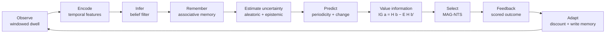

# AAMS-X — Adaptive Associative Active-Sensing & Memory Scheduler

**SIH26055 — Smart Scan Strategy for Electronic Warfare**

A receiver can only listen to a slice of the band at a time. AAMS-X decides *where to
point it next*, step after step, under partial observability, changing activity and a
finite sensing budget — and shows its reasoning for every decision it makes.

Every environment in this repository is a **replay of real, public e-CALLISTO solar
radio spectrometer measurements**. There is no parametric simulator anywhere in the
codebase: if the offline cache is empty, the data-dependent tests skip loudly rather
than quietly testing a fake.



## What it does

| | |
|---|---|
| **Problem** | Choose one contiguous window of `W` regions out of `R` each step, to find and hold activity you cannot see |
| **Primary policy** | **MAG-NTS** — Memory-Augmented, Information-Guided Non-Stationary Thompson Sampling, fully explainable |
| **Baselines** | Round Robin, Random, UCB, Thompson, NTS (deep RL only behind a feature flag) |
| **Environment** | Real e-CALLISTO recordings, spliced to create measurable distribution shift and recurrence |
| **Evaluation** | Multi-seed means with 95% CIs, Welch *t* + Mann-Whitney U, Pareto frontier over 4 declared objectives |
| **Honesty** | Occupancy labels are *derived from measurement*, not absolute truth; every panel is tagged `measured`, `derived-label` or `model-inferred` |

## Quickstart

```bash
python3.12 -m venv .venv && . .venv/bin/activate
pip install -e ".[dev]"

cp .env.example .env                  # nothing secret is required
python scripts/fetch_real_data.py     # ~150 MB of real recordings, 7 stations
python scripts/build_index.py         # measured window index (DuckDB over Parquet)

pytest                                # 440 tests
uvicorn aamsx.api.app:create_app --factory --reload    # http://127.0.0.1:8000/api/docs
```

Or with the Makefile: `make setup && make data && make index && make test && make api`.

## Repository map

```
aamsx/
  contracts/          typed boundary objects — Observation, Feedback, DecisionContext
  datasets/           e-CALLISTO adapter, FITS reader, calibration, Parquet cache, window index
  environment/        region grid, replay environment, derived truth, scenario library
  belief/             two-state Markov belief filter with decay
  features/           temporal encoder and rolling buffer
  memory/             modern-Hopfield associative memory over context prototypes
  change_detection/   composite Page-Hinkley + EWMA detector
  periodicity/        prominence-gated autocorrelation recurrence engine
  information_gain/   entropy and expected-information-gain engine
  schedulers/         MAG-NTS + every baseline, behind one interface
  evaluation/         reward, events, metrics, statistics, Pareto
  experiments/        runner, batch, async engine, reproducibility registry
  reports/            HTML report generator (executed values only)
  api/                FastAPI app — REST + WebSocket streaming
web/                  React + TypeScript frontend
docs/                 the seven documents below
scripts/              fetch_real_data, build_index, run_benchmark, tune_mag_nts, sensitivity
```

## Documentation

| Document | What it covers |
|---|---|
| [ARCHITECTURE.md](docs/ARCHITECTURE.md) | Module boundaries, the closed loop, data flow, leakage prevention |
| [ALGORITHMS.md](docs/ALGORITHMS.md) | Every equation, every constant, and why it has the value it has |
| [DATA.md](docs/DATA.md) | e-CALLISTO ingestion, calibration, derived labels, the window index |
| [EXPERIMENTS.md](docs/EXPERIMENTS.md) | The four signature experiments and the measured results |
| [SIH_DEMO.md](docs/SIH_DEMO.md) | A timed walkthrough for the evaluation panel |
| [LIMITATIONS.md](docs/LIMITATIONS.md) | What AAMS-X does not do, and where it loses |
| [API.md](docs/API.md) | Every endpoint, with request and response shapes |

## Scope

AAMS-X is an **academic research platform on public spectrum data**. It does not
transmit, jam, identify military emitters, geolocate anything, control hardware, or
recommend tactical frequencies. It schedules a receiver over archived measurements and
measures how well it did. See [LIMITATIONS.md](docs/LIMITATIONS.md).
