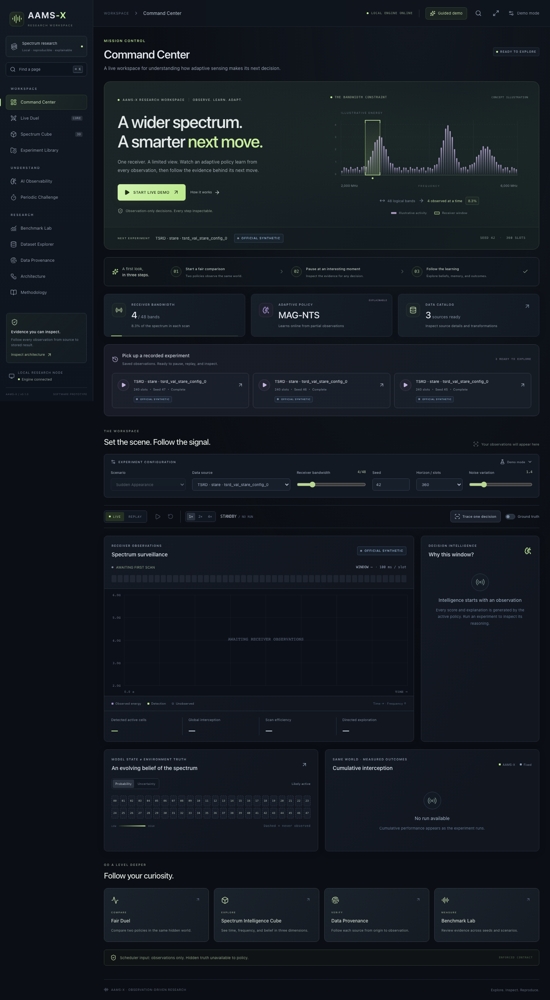
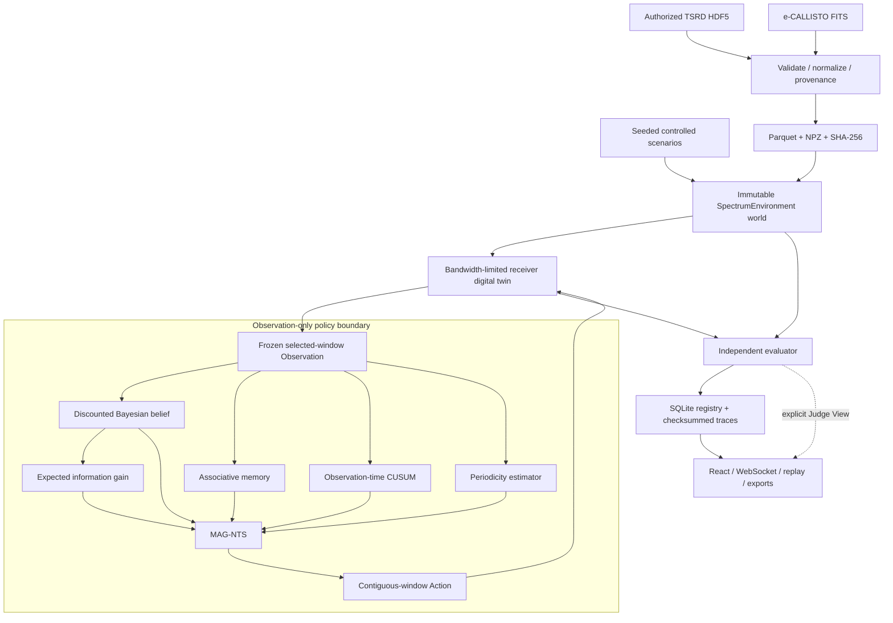
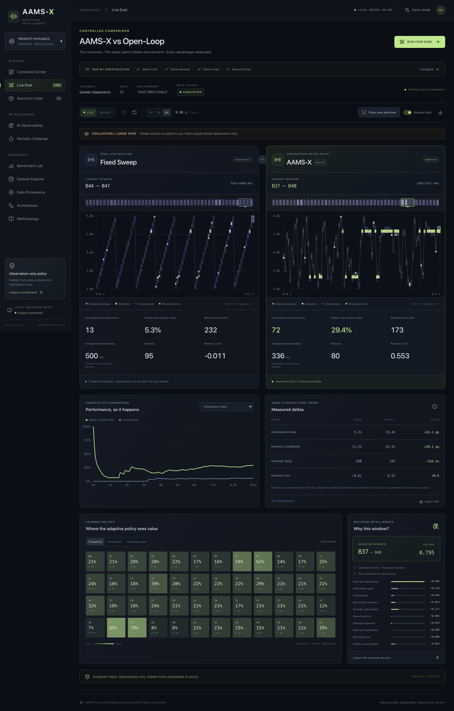
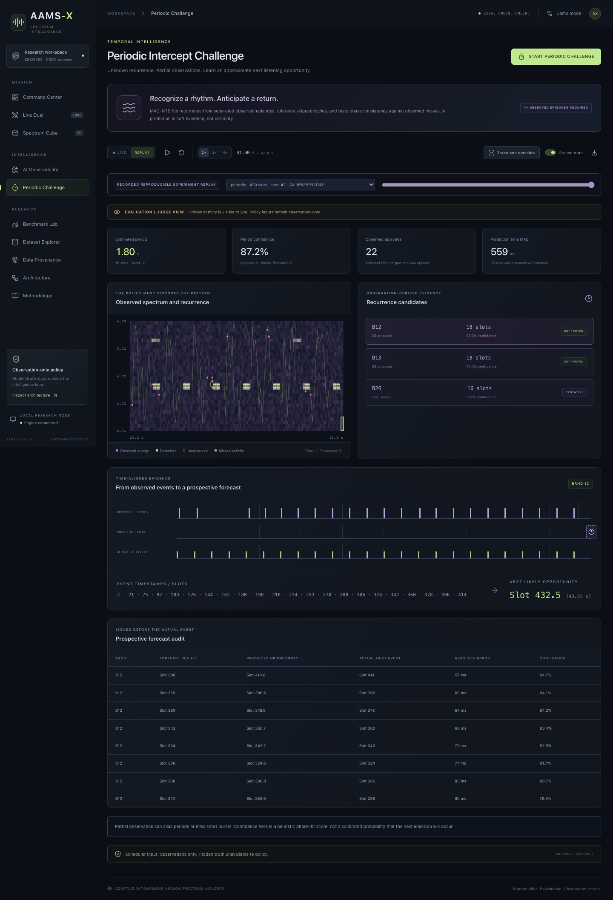
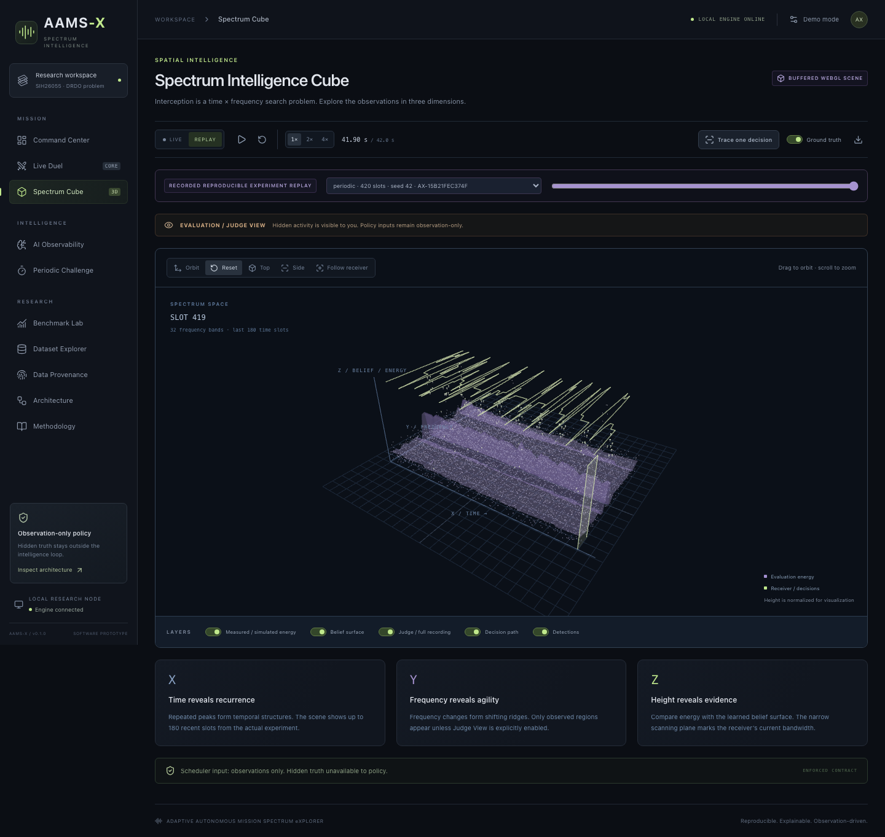

# AAMS-X

### Adaptive Autonomous Mission Spectrum eXplorer

[](https://github.com/Siddhanthkjain2005/AAMS-X/actions/workflows/ci.yml)

## SIH judging resources

| Resource | Open here |
|---|---|
| Website demo | [Open the Azure live demo](https://aams-x-sih.livelyocean-37549b44.eastasia.azurecontainerapps.io) |
| Source code | [Siddhanthkjain2005/AAMS-X](https://github.com/Siddhanthkjain2005/AAMS-X) |
| SIH presentation | [Download the presentation](presentation/AAMS-X-SIH2026.pptx) |
| YouTube walkthrough | **VIDEO LINK TO BE ADDED** |
| Verified dataset evaluation | [Official TSRD results and limitations](docs/validation/tsrd/README.md) |

### A three-minute walkthrough

1. **Command Center:** choose the official TSRD source and see the receiver's bandwidth budget.
2. **Live Duel:** compare scheduling policies on the same world. Inspect which bands each receiver actually observes.
3. **AI Observability:** pause a decision and inspect beliefs, memory, change detection and candidate scores.
4. **Spectrum Cube:** rotate the 3D time-frequency view. Hidden truth remains a separate evaluator view.
5. **Benchmark Lab:** open the stored TSRD results, inspect seed variation and confidence intervals, download CSV, then replay a run.
6. **Data Provenance:** verify the source recording, units, transformations and SHA-256 hashes.

### Evidence snapshot

The official TSRD evaluation covers **648,034 retained pulses**, **24 paired worlds** and **192 policy evaluations**. Eight algorithms share each world's receiver budget and detector realization. At 4/64 bands, six-seed mean global recall is **31.48% for MAG-NTS**, **5.47% for fixed sweep** and **36.75% for Thompson**. Thompson leads on this recording. These are scheduling results over one official synthetic validation recording with modeled receiver noise, not field measurements or pulse-deinterleaving scores.

**Validation:** 36 backend tests pass, including actual-file provenance, deterministic reruns, benchmark API acceptance and compressed responses. TypeScript and the production website build pass. See [the validation record](docs/VALIDATION.md) for scope and limitations.

The Azure demo keeps one instance running rather than scaling to zero. [Hosting settings, costs and data durability](docs/AZURE.md) explain its availability limits. The YouTube row is an intentional placeholder for the team's forthcoming video.

**An observation-only, uncertainty-aware active-sensing research workbench.**

Built around SIH26055, **Smart Scan Strategy for Electronic Warfare**, a DRDO software problem statement: a receiver with limited instantaneous bandwidth must decide which contiguous frequency window to observe next.

AAMS-X provides a working local simulator, receiver digital twin, online MAG-NTS scheduler, fair comparisons, dataset adapters, live WebSockets, explainability, a Three.js spectrum cube, multi-seed benchmarks, and recorded experiment replay.



## Run locally

Dependencies and the production frontend have been installed and built in this workspace:

```bash
./start_demo.sh
```

Open **http://127.0.0.1:8000**. API documentation: **http://127.0.0.1:8000/docs**.

For a fresh checkout, install once:

```bash
python3 scripts/setup.py
./start_demo.sh
```

Requirements: Python **3.11+**, Node.js **20.19+** (22 recommended), npm, and a WebGL-capable browser for 3D. `uv` is used if available; a pinned `requirements.lock` provides the pip fallback. JavaScript dependencies are locked in `frontend/package-lock.json`.

The production launcher serves the API, frontend, and WebSocket from **one process**. Initial dependency installation needs internet; normal operation does not. Fonts, visualizations, public-data artifacts, recorded runs, and benchmark traces are local.

Cross-platform alternative:

```bash
python scripts/start.py
```

Set `PORT=8080` to use a different port. See [the three-minute judging guide](docs/JUDGING_GUIDE.md).

## Dataset availability — explicit, not simulated away

| Source | Category | This workspace | Evaluation scope |
|---|---|---|---|
| AAMS-X controlled environment | `CONTROLLED_SIMULATION` | Available; ten seeded presets | Complete truth within the abstract simulator |
| Alan Turing Institute TSRD | `OFFICIAL_SYNTHETIC_RADAR` | **Installed: 648,034 official pulses; 24 paired worlds / 192 policy evaluations** | Retained stare-mode pulse occupancy; scan-mode negatives are censored |
| e-CALLISTO / FHNW public archive | `REAL_MEASURED_RF` | **Actual recording included**, 705,600 standardized samples | Measured intensity, coverage and detector events; no labelled EW emitter truth |

**TSRD is the primary SIH evaluation source in this installation.** The authorized `tsrd_val_stare_config_0.h5` recording contains 648,034 pulses. Benchmark Lab defaults to official TSRD and lets users compare other sources explicitly. See [the reproducible evaluation](docs/validation/tsrd/README.md). This is official synthetic radar data with modeled receiver noise, not a hardware field trial. Fresh downloads still require accepting the publisher's Hugging Face conditions.

The included measured recording is **ALASKA-ANCHORAGE, 2024-05-10 16:00 UTC**, obtained from the public e-CALLISTO archive. It is a solar-radio spectrum recording, **not a recording of hostile radars**. Its original intensity unit is `digits`.

> Real measured RF replay — e-CALLISTO public spectrum observations. Used for ingestion and robustness demonstration, not labelled EW emitter ground truth.

Source URLs, SHA-256 hashes, timestamps, physical axes, transformation lineage, and retained features are visible in **Data Integrity & Provenance**. See [dataset documentation](docs/DATA.md) for formats, attribution and import commands.

## The problem, and our interpretation

The full spectrum contains many potential sources. The receiver can observe only a narrow slice. A fixed sweep spends the same predetermined time on inactive and useful regions; short events can occur between revisits.

The decision is an active-sensing problem under **partial observation**:

1. Choose a legal contiguous bandwidth window.
2. Receive energy and HIT/MISS observations from **that window only**.
3. Update a probabilistic model and its uncertainty.
4. Learn recurring observation contexts and possible periodic opportunities.
5. React to observed distribution shifts.
6. Choose the next window while accounting for sensing and retuning costs.

Hidden truth belongs to the simulator and evaluator. A policy never receives an environment reference, source labels, complete energy matrix, or future timeline.

## Architecture



### Programmatic truth isolation

[`backend/contracts.py`](backend/contracts.py) is the complete policy-facing contract:

```python
policy = Policy(algorithm, PublicReceiver.from_config(receiver), policy_seed)
decision = policy.select_action(DecisionContext(step, previous_start))
observation = environment.step(decision.action)
policy.update(observation)
```

`Observation` and its per-band values are frozen dataclasses. An observation validates that its bands match exactly the selected window. The receiver receives only sliced energy and detector random fields. `Receiver.observe()` never branches on truth labels.

**`test_POLICY_TRUTH_LEAK_TEST`** checks policy imports, privileged attributes, file-reading/introspection capabilities, observation fields, and counterfactual noninterference: modifying every unobserved truth/energy value leaves the policy's decisions and updates unchanged until its observations change.

This is an enforced architectural contract and regression guard, **not an adversarial Python sandbox**.

## MAG-NTS

**Memory-Augmented, Information-Guided, Non-Stationary Thompson Sampling** is an experimental composition of interpretable online methods.

### Belief and uncertainty

Each band starts with weak Beta(1, 1) evidence. With discount factor `λ = 0.989`:

```text
α ← 1 + (α − 1) λ^Δt
β ← 1 + (β − 1) λ^Δt
w = 0.5 + 0.5 × observation confidence
α ← α + w × HIT
β ← β + w × MISS
p = α / (α + β)
uncertainty = sqrt(12 αβ / ((α + β)² (α + β + 1)))
```

Missing observations do not update evidence. Unobserved bands are never treated as misses. Discounting returns stale evidence toward the prior. Confidence weighting and discounting make this a **generalized/pseudo-Bayesian activity model**, not a calibrated posterior for a complete RF propagation model.

One-observation information gain is calculated from the Beta-Bernoulli mutual information using `scipy.special.digamma`. “Likely active” and “uncertain — worth exploring” are separately visualized.

### Window score

Legal candidates include every contiguous start position. Per-band terms are averaged within each window:

```text
0.8 × learned probability + 0.4 × Thompson sample
+ 0.65 × normalized information gain
+ 0.16 × normalized uncertainty
+ 0.28 × memory evidence
+ 0.75 × periodic opportunity
+ 0.22 × revisit age
+ 0.30 × recent-change priority
+ directed exploration bonus (12% probabilistic branch)
− 0.24 × retune cost
− 0.14 × repeated-empty-observation penalty
```

All terms come from observations or public receiver geometry/costs. Every selected action stores its component contributions, pre-observation probabilities, uncertainty, and five candidate alternatives.

- **Memory:** bounded four-observation contexts and subsequent observed outcomes, matched by sequence similarity, frequency proximity and age. Retrieval contributes soft evidence.
- **Change:** two-sided observation-time CUSUM, minimum evidence and cooldown. A supported change softens stale evidence and adds temporary exploration priority. An unseen change cannot be known instantly.
- **Periodicity:** at least four separated observed episodes spanning three candidate cycles; integer-multiple interval fitting tolerates missed episodes. Phase consistency and observed misses reduce confidence. Adjacent hits within one burst are merged. Confidence is an explicitly heuristic evidence score; aliasing is possible.
- **Baselines:** fixed sweep, uniform random, vanilla Thompson sampling, and UCB. Fixed sweep covers the tail even when bandwidth does not divide the spectrum.
- **Ablations:** no memory, no information gain, and no change detection. Each removes that component from the same implementation.

These weights are explicit research hyperparameters. The composite scheduler has **no optimality or universal-improvement guarantee**. No neural network or offline truth-trained predictor is hidden behind it.

## Receiver model

For each fixed wall-clock slot:

```text
usable dwell = slot duration − scan latency − retune delay if moved
retune cost = retune delay / slot duration
            + switching weight × normalized frequency distance
```

Configuration validation requires enough remaining time for minimum dwell. Longer retuning therefore changes both detection exposure and accounting cost.

The energy detector uses a logistic threshold response, usable-dwell fraction, an additional miss probability and an independent spurious-alarm draw. All detector fields are drawn **once per world**, indexed by time and band, and reused by every receiver. The configured spurious-alarm parameter is not the complete measured Pfa: noise crossing the energy response can also cause alarms.

This is a tractable **digital-twin approximation**, not a waveform-level or calibrated hardware model. Simulation uses dominant per-band signal strength rather than full coherent signal superposition. Measured replay uses calibration-standardized intensity; original instrument units remain in the dataset explorer and Parquet.

## Fair experiments and metrics

**RUN FAIR DUEL** creates one immutable world and independent policy/receiver states with identical seed, energy, detector noise, receiver limits, horizon and timing budget. The UI displays a world fingerprint and experiment ID.



Metrics are computed from stored pre-decision values, observations and evaluation labels:

| Metric | Definition used here |
|---|---|
| Probability of detection | `TP / (TP + FN_observed)` |
| Probability of false alarm | `FP / (FP + TN)` on observed inactive cells |
| Sensitivity / global recall | `TP / all active band-time cells`, including unobserved activity |
| Average interception rate | Mean of per-slot `TP_t / active_t` over nonempty slots |
| Average reward | Mean `TP − FP − 0.1 × retune_cost` |
| Reward / cost | Total evaluation reward / total `(1 + retune_cost)` |
| Correct prediction percentage | Pre-observation `p ≥ 0.5` classification accuracy on observed cells |
| Average intercept time | First-detection delay among intercepted band-activity episodes |
| Average intercept time error | Prospective next-onset prediction MAE, scored after the actual event |
| Interception ratio | Intercepted band-activity episodes / episodes begun |

Supporting metrics include miss rate, active-cell scan efficiency, active-scan percentage, retuning counts/costs, source-overlap first-detection delay, Jain coverage fairness, explicit exploration percentage, missing-channel fraction, and observed energy-event count.

**Important scope details:**

- Detector Pd is conditional on being observed; it is not full-spectrum recall.
- A band-activity episode is not an identified emitter.
- Average delay is conditional on interception. Read the episode censoring fraction alongside it.
- Source-overlap detection does not claim emitter classification or identity resolution.
- “Intercept time error” is operationalized as recurrence forecast error, not hardware timestamp precision. Only the first supported forecast per band/next-onset is scored, and only after that actual onset occurs.
- Truth-derived reward never enters `policy.update()`.
- Undefined denominators yield `null` / **N/A**. Measured RF has no truth-dependent Pd, Pfa, recall, reward, accuracy or interception-time results.

All definitions are available in the **Methodology** page and `GET /api/methodology`.

## Reproducible evidence included

The bundle contains **30 paired worlds / 180 policy evaluations**: all ten presets, consecutive seeds **42–44**, a **240-slot** horizon, and six policies. Benchmark ID: **`BENCH-723C785465`**. These values are computed results, not frontend constants.

Selected means from that exact bundled experiment:

| Scenario | Fixed global recall | MAG-NTS global recall | Vanilla Thompson global recall |
|---|---:|---:|---:|
| Sparse | 7.27% | 49.24% | 63.63% |
| Periodic | 1.27% | 25.82% | 21.52% |
| Changing | 7.70% | 37.16% | 27.36% |
| Randomized | 6.47% | 7.46% | 6.86% |

MAG-NTS improves over fixed scanning in the bundled suite, but vanilla Thompson often outperforms the composite policy in stable conditions. Small seed counts and wide confidence intervals do not establish universal superiority or field performance. The Benchmark Lab exposes all scenarios, ablations, means, medians, sample variance, 95% Student-t mean intervals and paired deltas.

```bash
# Inspect the recorded evidence
.venv/bin/python scripts/research_report.py

# Regenerate demo runs plus all scenarios/seeds/ablations
.venv/bin/python scripts/prepare_demo.py --benchmark
```

The periodic challenge uses 32 bands, width 4, seed 42, and 420 slots. Its recorded run learns an **18-slot period** from observations; it also retains wrong/tentative candidates and scores forecast error rather than hiding it.



## Product workflow

- **Command Center:** problem briefing, receiver geometry, source selector, six demo controls and advanced research settings.
- **Live Duel:** two observation waterfalls, real receiver paths, cumulative detections/misses, delay, reward/cost and measured deltas.
- **Trace one decision:** freeze acquisition and inspect ten stages, including pre-decision beliefs and post-observation updates.
- **AI Observability:** probability, uncertainty, information gain, unvisited bands, memory evidence, CUSUM events and policy input payload.
- **Periodic Challenge:** observed episodes, inferred period/phase, evidence confidence, next opportunity and prospective forecast audit.
- **Spectrum Intelligence Cube:** real Three.js time × frequency × energy/belief geometry; orbit, top, side, reset, follow, path/detection/layer controls.
- **Benchmark Lab:** run ablations and multi-seed comparisons, export CSV/JSON and replay every paired world.
- **Dataset Explorer / Provenance:** inspect measured spectrograms or PDW features, original axes, sample Parquet, lineage and checksums.
- **Architecture / Methodology:** animated observation flow, component roles, formulas, limitations and judge questions.

**LIVE** means the scheduler is computing now. With a recording selected, the RF source itself is still a recorded replay. **REPLAY** means playback of a previously computed experiment trace and is visibly labelled that way. Ground Truth is off by default.



## Dataset ingestion

Restore the included measured artifact entirely offline:

```bash
.venv/bin/python -m backend.datasets.bootstrap
```

Re-download and reproduce the public measured import:

```bash
.venv/bin/python -m backend.datasets.fetch callisto
```

After accepting the TSRD publisher's access conditions, either import an authorized local file:

```bash
.venv/bin/python -m backend.datasets.ingest turing data/raw/config_0.h5 \
  --receiver-mode stare --max-pulses 1000000 --slots 512 --bands 64
```

or set `HF_TOKEN` locally in your terminal environment and run:

```bash
.venv/bin/python -m backend.datasets.fetch turing
```

Tokens are never written into provenance. Do not paste credentials into application source files. The downloader pins the publisher revision and uses one bounded validation file. Importing a missing or incompatible schema fails with an actionable error.

Details: [docs/DATA.md](docs/DATA.md).

## API and event model

| Route | Purpose |
|---|---|
| `GET /api/status`, `/api/scenarios`, `/api/datasets` | Readiness, presets and provenance catalog |
| `GET /api/datasets/{id}/preview` | Bounded original-unit preview and samples |
| `GET /api/datasets/{id}/export?format=npz\|parquet` | Verified processed artifact |
| `POST /api/experiment/start` | Start a fair experiment with explicit configuration |
| `POST /api/experiment/pause`, `/resume`, `/reset`, `/stop`, `/speed` | Live controls |
| `POST /api/experiment/{id}/step` | One observation while paused |
| `GET /api/experiments`, `/api/experiment/{id}` | Registry and configuration |
| `GET /api/experiment/{id}/metrics`, `/trace`, `/decisions` | Results and explainability |
| `GET /api/experiment/{id}/evaluation?judge=true` | Explicit evaluation-only source tracks |
| `GET /api/experiment/{id}/export?format=json\|csv` | Trace/metric export |
| `POST /api/benchmark/start`, `GET /api/benchmarks` | Background benchmark jobs |
| `GET /api/benchmark/{id}`, `/export` | Progress, statistical summary and export |
| `WS /ws/experiment/{id}` | Incremental, reconnectable observation/decision stream |

Every step stores timestamp, action, previous window, retune cost, selected-band observations, detector hits, pre-decision beliefs, uncertainty, candidate scores, memory/periodicity evidence, change events, post-update beliefs and cumulative metrics. Evaluation fields are omitted from normal HTTP/WebSocket frames unless Judge View is explicitly requested.

Experiment JSON export is an **evaluation bundle** and includes truth for auditing. It is never a policy input. See [engineering and mathematical notes](docs/METHODOLOGY.md).

## Offline replay and performance

- SQLite indexes immutable compressed JSON traces with artifact and canonical-trace SHA-256 checksums.
- Bundled benchmark traces are included, so their **Replay Run** buttons work on an empty local registry.
- Deterministic replay means identical recorded scientific events; UUIDs and ingestion dates are metadata.
- The frontend caps waterfalls to 128 recent slots and the cube to 180 slots with approximately 9,000 energy points maximum, plus bounded detection points and belief geometry.
- Original recordings are not streamed every animation frame. The API sends incremental observations and summaries, with at most eight frames per WebSocket batch.
- Simulation/benchmark work runs off the asyncio delivery loop using worker threads. It remains a local, single-process research application.
- The 3D scene has a 2D fallback. A WebGL 2 scene, camera controls, mobile layout and all navigation have been exercised in Chromium.

## Tests and validation

```bash
./run_tests.sh

# Browser checks, including genuine WebGL and downloads
npm exec --prefix frontend -- playwright install chromium
npm --prefix frontend run test:e2e
```

Backend coverage includes truth isolation, counterfactual noninterference, receiver limits/dwell, seeded worlds, confidence-weighted beliefs, recurrence evidence, CUSUM, episodic memory, baselines/ablations, hand-calculated metrics, prospective forecast error, replay corruption, API/WebSockets, FITS, HDF5, missing channels and causal measured-data calibration.

Browser tests exercise starting and pausing a live duel, ten-step explanations, measured exports, replay selection/scrubbing, all navigation, periodic candidates, WebGL 2 and camera controls, genuine measured-data inspection, truth-metric N/A behavior, benchmark execution and mobile/missing-data fallback. Screenshots above are captured from the running application.

The current resolved FastAPI/Starlette test client emits upstream deprecation notices, and Vite reports the size of the Three.js vendor chunk. Neither is an application runtime error. See [docs/VALIDATION.md](docs/VALIDATION.md) for the checked state and remaining external prerequisite.

## Repository layout

```text
backend/
  contracts.py           # complete, immutable policy input surface
  environment/           # seeded worlds and common environment API
  receiver.py            # energy-only bandwidth/dwell digital twin
  scheduler/             # beliefs, memory, CUSUM, periodicity, policies
  metrics.py             # evaluator-only metrics and definitions
  experiments/           # fair runner, SQLite/trace registry, benchmarks
  datasets/              # FITS/HDF5 adapters, provenance and calibration
  api.py                 # HTTP, WebSocket and production static serving
  tests/
frontend/src/
  components/ pages/     # command center, duel, research and explanation
  stores/ hooks/         # live transport and replay state
  visualizations/        # bounded observed/real-data canvases
  charts/ three/         # statistical comparisons and intelligence cube
data/
  raw/ processed/        # runtime cache; source hashes and provenance
  demo/                  # portable measured data, runs and benchmarks
  experiments/           # local registry and new experiment artifacts
scripts/ docs/
```

## Limitations and future work

Performance depends on modeled source structure, detector assumptions, bandwidth, dwell and discretization. Public measured solar RF does not provide operational EW truth. Synthetic/public results are not field validation. Unpredictable sources impose fundamental interception limits. Component benefits are scenario-dependent, and recurrence confidence is not calibrated.

The next research steps are calibrated SDR integration, hardware-in-the-loop experiments, multi-receiver cooperation, richer partially observable policies, broader measured datasets, decentralized sensing and long-duration edge evaluation. These are future extensions; the current application is a software research prototype.
