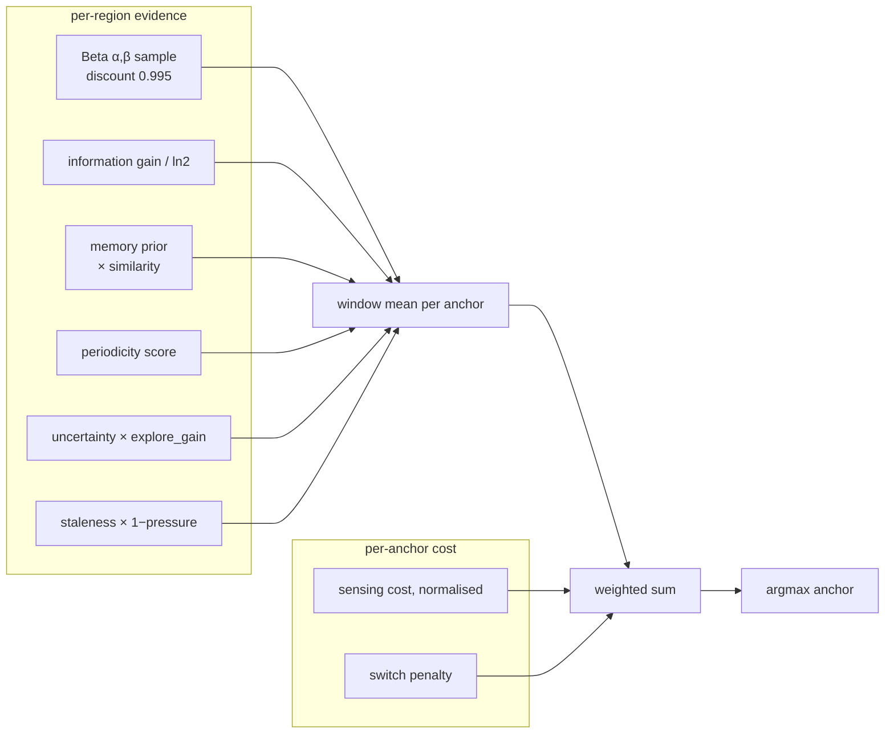

# Algorithms

Every equation AAMS-X uses, with the constants it uses and the reason each constant has
the value it has. Where a value was chosen by measurement, the measurement is quoted.

## 1 · Region grid

The e-CALLISTO frequency axis is **non-linear** — channel spacing varies across the
band — so regions are built with **equal channel counts**, not equal bandwidth:

```
counts[i] = n_channels // R  (+1 for the first n_channels % R regions)
starts    = cumsum(counts) shifted right
```

Every channel belongs to exactly one region, `counts.max() - counts.min() <= 1`, and
the grid refuses a band it cannot fill (`R > n_channels` is an error, not a silent
truncation). Duplicate band-edge frequencies are dropped as a documented preprocessing
step. Region "occupancy" is defined from the **best** channel in the region:

```
margin_db[r] = max over channels c in r of (excess_db[c] - threshold_db[c])
occupied[r]  = margin_db[r] > 0
```

Taking the maximum is deliberate: a region is worth dwelling on if *anything* in it is
active, not if the average of it is.

## 2 · Calibration and derived labels

Absolute power is not available from the archive, so the reference is drift-tracked:

| Quantity | Definition | Constant |
|---|---|---|
| Baseline | P10 of each 2400-sample block, interpolated between block centres | `AAMSX_BASELINE_PERCENTILE=10` |
| Excess | `power − baseline`, in dB | `AAMSX_DB_PER_DIGIT=0.25` |
| Noise scale | `1.4826 · MAD(diff(power)) / √2` | first-difference MAD |
| Threshold | `max(min_excess_db, k_mad · σ)` per channel | `1.5 dB`, `k_mad=5.0` |

The first-difference form is what makes the noise estimate robust to the signal itself:
`diff` removes the slow drift, MAD removes the outliers, and `/√2` corrects for
differencing two independent samples.

> These are **reference labels derived from measurement**, not absolute ground truth.
> The API tags every panel that uses them `derived-label`, and the report says so in
> print. See [DATA.md](DATA.md) and [LIMITATIONS.md](LIMITATIONS.md).

## 3 · Belief filter

A two-state Markov chain per region, updated in odds form.

**Predict.** With learned transition rates `p_on` (off→on) and `p_off` (on→off):

```
b⁻ = b·(1 − p_off) + (1 − b)·p_on
```

Unobserved regions therefore decay toward the region's own stationary rate
`p_on / (p_on + p_off)` rather than toward a global constant — a region that is
*usually* busy stays a good bet while you are not looking at it.

**Update.** The probability a measurement `m` came from an occupied cell is `Φ(m/σ)`,
so the likelihood ratio is `Φ / (1 − Φ)` and Bayes is a product of odds:

```
odds⁻ = b⁻ / (1 − b⁻)
odds⁺ = odds⁻ · Φ(m/σ) / (1 − Φ(m/σ))
b⁺    = odds⁺ / (1 + odds⁺)
```

A marginal +0.3 dB reading moves belief far less than a +6 dB one, which a hard
threshold could not express.

**Uncertainty decomposition.**

```
aleatoric[r]  = b·(1 − b)                       ← irreducible coin-flip variance
epistemic[r]  = Var[Beta(α, β)]  capped at 0.25 ← how little we have looked
uncertainty[r] = normalised combination in [0, 1]
```

The cap matters: an unvisited region must not look infinitely interesting, or the
policy never converges. `entropy()` is a **method**, not a property — it sums binary
entropy over regions and is the quantity the information-gain engine differentiates.

## 4 · Temporal encoder

A rolling buffer produces global engineered features per step: activity rate, its short
and long moving averages and their ratio, detection-rate trend, spatial concentration
(normalised Herfindahl over the belief vector), profile drift against the running mean,
budget fraction, and steps-since-change. These are inputs to memory addressing and to
the change detector's surprise signal. `features/neural.py` can replace the memory
*key* with a seeded single-layer GRU cell over the same 66-d context when
`AAMSX_ENABLE_NEURAL=true` (an optional extra, off by default, requires the `torch`
extra). The 18 named features are unchanged either way. With random weights it is a
**reservoir** — a fixed nonlinear recurrent projection, not a learned representation —
and no number in `docs/EXPERIMENTS.md` was produced with the flag on.

## 5 · Associative memory (modern Hopfield)

Memory stores **contexts**, not actions — the thing worth recognising is "this looks
like the busy-low-band regime again", and the action preference is what that regime
recommends.

**Address.** The context vector is whitened by a Welford `RunningStandardiser`, which
mean-centres only until `warmup=24` samples exist (dividing by a variance estimated
from three samples is worse than not dividing at all).

**Retrieve.** Softmax attention over stored prototypes, i.e. one modern-Hopfield step:

```
similarity  = cosine(query, prototype_j)
weights     = softmax(β · similarity),      β = 12.0
prior       = Σ_j weights_j · preference_j
similarity* = max_j similarity_j
```

`β = 12.0` is sharp enough that a genuine match dominates and flat enough that a
near-miss still blends. Retrieval is only *applied* above
`RECOGNITION_THRESHOLD = 0.90`.

**Write.** A new prototype is written when `similarity* < write_threshold = 0.88`,
otherwise the matching prototype is updated. Capacity is bounded at **24**; eviction is
by utility (`utility_decay = 0.85`) with `protect_steps = 60` grace for young
prototypes and a recency term (`recency_tau = 400` steps). Preference vectors decay at
`0.8`, prototype vectors at `0.9`.

| Constant | Value | Why |
|---|---|---|
| `capacity` | 24 | Bounded by design — an unbounded memory is a lookup table, not a generalisation |
| `beta` | 12.0 | Sharp retrieval without collapsing to nearest-neighbour |
| `write_threshold` | 0.88 | Below `RECOGNITION_THRESHOLD`, so a recognised context updates instead of duplicating |
| `top_k` | 3 | Blends at most three prototypes; more just averages the band flat |

## 6 · Change detection

Three symptoms are combined into one standardised statistic, then two detectors vote:

```
statistic = 1.0·surprise + 1.0·profile_divergence − 1.0·detection_rate
```

standardised online (`alpha=0.02`, `warmup=40`) and fed to:

- **Page-Hinkley** — cumulative deviation with slack `delta = 2.0`, fires at
  `threshold = 28.0`. Detects a sustained mean shift.
- **EWMA** — level with `alpha = 0.15`, fires at `k = 4.0` sigma, requires
  `consecutive = 3` confirmations after `warmup = 40`.

A `refractory = 90` step window suppresses re-firing. On a change, MAG-NTS multiplies
its Beta evidence by `change_discount = 0.4` (forgetting 60% of what it knew) and adds
`change_boost = 0.8 · change_score` to its exploration gain.

**Measured behaviour.** This configuration is conservative on purpose: a lone
detection-rate collapse does **not** trip it at `delta = 2.0` — the *spatial profile*
shift is what fires it. That conservatism buys a measured false-alarm rate of 1 in 28
episodes. On the `sudden-shift` preset the detector's contribution is
`+14.68` reward over NTS (`p = 0.398`, not significant on 6 seeds); on
`recurring-environment` it is `+20.82` (`p = 0.028`, significant). See
[EXPERIMENTS.md](EXPERIMENTS.md).

## 7 · Periodicity

`dominant_period(signal, *, min_lag=4, max_lag=None, min_prominence=0.12)` — a
prominence-gated autocorrelation:

```
search range: [min_lag, limit),  limit = min(max(min_lag + 2, n // 3), n − 2)
significance: Bartlett bound 1.96 / √n
returns (0, 0.0) when n < 4·min_lag or variance ≈ 0
```

The search range is the honest statement of what the engine can see: **periods shorter
than 4 steps, or longer than a third of the window, are undetectable by construction**,
because a period is only reported where four cycles could have been observed.

`dominant_period` alone does **not** reject white noise at `n = 600` — it returns a
non-zero lag about 93% of the time, though with strength ≤ 0.1644. Rejection comes from
the strength scaling plus the consecutive-confirmation guard, not from the lag test.

## 8 · Information gain

The engine is exact for the two-state model, not a heuristic:

```
IG(a) = H(b) − E[H(b′) | a]
```

where the expectation runs over the two possible measurement outcomes of each region in
the window, weighted by their predictive probabilities under sensitivity `s` and
false-alarm rate `f`:

```
P(detect | r)  = b_r·s + (1 − b_r)·f
b′ on detect   = b_r·s / P(detect | r)
b′ on no-detect= b_r·(1 − s) / (1 − P(detect | r))
```

Properties, all asserted by property-based tests in `tests/test_properties.py`:

- `IG ≥ 0` always, and `IG ≤ H(b)` always.
- A sensor with `s == f` is worth exactly nothing — it carries no information.
- A near-perfect sensor recovers `≥ 0.9 · H(b)` for beliefs in `[0.02, 0.98]`.
- `window_information_gain` equals the brute-force sliding sum.
- `maximum_possible_gain(n) = n · ln 2`.

## 9 · Receiver model

```
cost(a)  = cost_per_observation + switch_cost · |anchor_new − anchor_old| / (R − W)
measured = margin_db + N(0, noise_db²)
detected = measured > 0
```

`noise_db = 0.4` is **calibrated against the real margin distribution in the cache**,
not picked for convenience: at 0.4 dB the receiver achieves a 0.90 cell detection rate
at a 0.094 false-alarm rate (Youden's J = 0.81). That leaves the *scheduling* problem —
not the front end — as the thing being measured. The `high-noise` preset raises it to
1.5 dB deliberately. `settling_penalty_db` optionally models sensitivity loss on the
step after a large retune; it is 0.0 by default.

Dwelling is never dearer than retuning, and `cost_per_anchor` agrees with `cost` —
both are property-tested.

## 10 · Reward

Interpretable, multi-objective, every weight exposed in the UI:

```
r_t = w_det·(hits/W)
    + w_inf·(bits/W)
    − w_delay·pending_delay
    − w_fa·(false_alarms/W)
    − w_switch·retune_fraction
```

| Weight | Default | Note |
|---|---|---|
| `detection` | 1.00 | |
| `information` | 0.35 | realised bits, not predicted |
| `delay` | **0.50** | see below |
| `false_alarm` | 0.50 | |
| `switching` | 0.05 | |

**The delay weight decides which policy wins**, so it gets its own paragraph. With a
token delay weight the objective collapses into "maximise raw detections", and the
winning strategy is to camp on the few busiest regions and ignore the rest of the band.
Measured, not asserted: at `delay = 0.10`, plain discounted Thompson sampling beats
every richer policy on this reward *while detecting 30% fewer distinct events*. That is
a defect in the objective, not a virtue of the policy. AAMS-X exists to find activity
across a band it cannot fully observe, so leaving live activity unwatched has to cost
something comparable to finding it. `delay = 0.50` makes those two terms commensurate.

No weighting is claimed to be universally right. `scripts/sensitivity.py` sweeps the
weight and reports how the ranking changes, and `aamsx/evaluation/pareto.py` refuses
the scalarisation entirely.

When the archive published no data for an interval, the detection, information,
false-alarm and switching terms are all zeroed — but **the delay term still applies**,
because activity going unwatched is going unwatched regardless of why.

## 11 · MAG-NTS

The primary policy. Per-region Beta-Bernoulli Thompson sampling with geometric
discounting, augmented by five more evidence sources and scored per candidate window.



Each evidence vector is averaged over the `W` regions of a candidate window
(`window_sum / W`), so the score is a per-region rate and windows of different content
are comparable. The eight weights:

| Term | Weight | Gated by ablation flag |
|---|---|---|
| `detection` | 0.94 | — (the Thompson core) |
| `information` | 0.07 | `information_gain` |
| `memory` | 0.57 | `memory` |
| `periodicity` | 0.27 | `periodicity` |
| `uncertainty` | 0.23 | `uncertainty_exploration` |
| `recency` | 0.17 | — |
| `cost` | −0.29 | — |
| `switching` | −0.10 | — |

These were tuned on `train`-role stations only, over the `persistent`, `bursting`,
`intermittent` and `distribution-shift` families, 3 seeds, selecting on win rate
against NTS with ties broken by mean advantage. The winning configuration achieved a
100% win rate and `+28.57` mean reward advantage. The protocol and every candidate are
recorded in `data/index/mag_nts_tuning.json`.

**Budget pressure** modulates exploration rather than clipping it:

```
affordable = budget_remaining / cost_per_observation
pressure   = clip(1 − affordable / steps_remaining, 0, 1)
explore_gain = (1 − pressure) + 0.8·change_score   [when both flags are on]
```

So exploration is expensive exactly when the budget is tight, and cheap right after a
detected change — which is when it is worth most.

**Explainability is structural, not bolted on.** `select()` returns an
`ActionProposal` carrying the decomposition for the chosen window, the score of every
candidate region (`per_region_value`, credited by the best containing window), the
exploration rate, and human-readable notes such as
`context recognised (similarity 0.94) — retrieved prior applied` or
`budget pressure 0.63: exploration attenuated`. The Decision Inspector screen renders
exactly these fields; nothing is reconstructed after the fact.

## 12 · Baselines

| Policy | Rule |
|---|---|
| `round-robin` | Sweep anchors in order. No learning; strong band coverage (measured 1.000) |
| `random` | Uniform anchor. The floor |
| `ucb` | `hit_rate + √(2 ln t / n)` per region, window-summed |
| `thompson` | Beta-Bernoulli posterior sampling, no discounting |
| `nts` | Thompson with geometric discount 0.995 — the non-stationary control |
| `mag-nts` | Above |

`nts` is the honest control for MAG-NTS: it isolates *memory, information gain,
periodicity and change response* by holding the sampling core fixed.

## 13 · Evaluation statistics

- **Aggregate**: mean, std, SEM, Student-*t* 95% CI, min, max, median over seeds.
- **Compare**: Welch *t*-test (unequal variances) **and** Mann-Whitney U (rank-based,
  survives skew), plus Cohen's *d*. `significant` requires both. `compare()` returns
  NaN for every statistic when either arm has fewer than two finite values — declining
  to report a p-value is the honest answer, not a bug.
- **Pseudo-regret**: against a clairvoyant window oracle that sees the truth and picks
  the best window each step. `oracle_ratio` is the achieved fraction.
- **Sustained events**: an event is a run of consecutive occupied steps in a region;
  `sustained_detection_probability` is the fraction detected at least once,
  `time_to_detect_capped` charges the cap for a miss so the metric cannot be gamed by
  ignoring hard events.
- **Pareto**: dominance over four declared objectives with explicit directions —
  `sustained_detection_probability (+1)`, `time_to_detect_capped (−1)`,
  `false_alarm_rate (−1)`, `sensing_cost (−1)`. Domination is never mutual, the
  frontier is never empty, and the ordering puts frontier points first.
