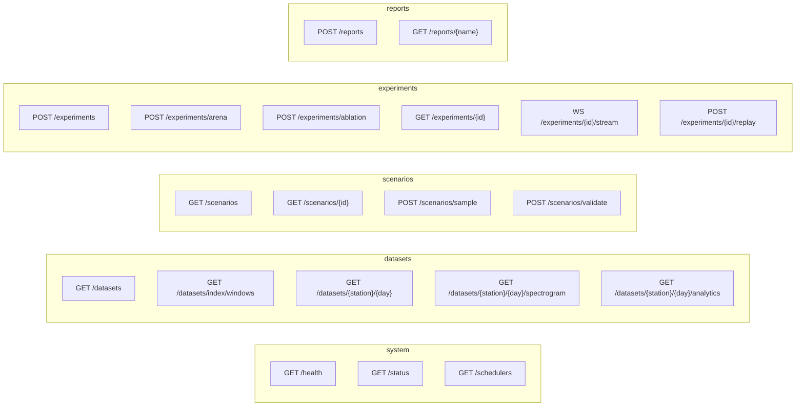

# API

FastAPI, mounted under `/api`. Interactive schema at `/api/docs`, machine-readable at
`/api/openapi.json`.

```bash
uvicorn aamsx.api.app:create_app --factory --reload
```

Every response that contains numbers derived from measurements carries a provenance
record and a **`kind`** field:

| `kind` | Meaning |
|---|---|
| `measured` | Straight from the archive, only unit conversion applied |
| `derived-label` | Computed under a stated labelling policy — a reference, not truth |
| `model-inferred` | Produced by AAMS-X's own belief/memory models |

## Endpoint map



## System

### `GET /api/health`
`{"status": "ok", "version": "...", "scheduler_version": "..."}`. Never touches disk, so
it stays green while the cache is being built.

### `GET /api/status`
Everything the UI needs to render an honest header on first paint.

```json
{
  "version": "…", "scheduler_version": "…",
  "data_mode": "REAL PUBLIC SPECTRUM REPLAY (e-CALLISTO, cached)",
  "network_allowed": false,
  "recordings": 7, "windows_indexed": 3350, "presets": 7,
  "schedulers": [{"name": "mag-nts", "label": "…", "description": "…"}],
  "neural_available": false, "deep_rl_available": false,
  "experiments": {"completed": 12, "running": 0, "failed": 0},
  "cache_mb": 139.4,
  "warnings": []
}
```

`warnings` is the honesty channel: it names an empty cache, a missing window index, or
fewer than 7 buildable presets, and tells the operator which script to run. There is no
synthetic fallback, so a degraded state is reported rather than papered over.

### `GET /api/schedulers`
`{"arena_order": [...], "schedulers": [...], "deep_rl_available": false}` — the policy
catalogue in Algorithm Arena display order, each with a human-readable description.

## Datasets

### `GET /api/datasets`
Cached recordings, the station catalogue, and adapter status:

```json
{
  "data_mode": "REAL PUBLIC SPECTRUM REPLAY",
  "adapters": [
    {"name": "e-callisto", "status": "active", "detail": "Public FITS archive, no credentials required."},
    {"name": "sigmf", "status": "import-only", "detail": "…"},
    {"name": "electrosense", "status": "unavailable", "detail": "…"}
  ],
  "recordings": [{"recording_id": "MRO/20260825", "…": "…", "role": "unseen", "kind": "measured"}],
  "catalogue": [{"key": "MRO/60", "band": "VHF+UHF wideband", "role": "unseen", "…": "…"}]
}
```

### `GET /api/datasets/index/windows`
Search the measured window index — the scenario library, as data.

| Param | Default | Notes |
|---|---|---|
| `where` | `TRUE` | Simple SQL predicate |
| `order_by` | `occupancy DESC` | Column plus direction |
| `limit` | 25 | 1–500 |

```
GET /api/datasets/index/windows?where=period_strength>0.5&order_by=period_strength DESC&limit=5
→ {"count": 5, "windows": [{"recording_id": "…", "start_step": 0, "occupancy": 0.31, …}]}
```

`profile` is excluded — a 48-vector is not a summary field. The tokens `;`, `--`, `/*`,
`attach`, `copy`, `install`, `pragma`, `create`, `drop` are refused with **422** `only
simple SQL predicates are accepted`; any other malformed predicate is also a 422. A
missing index is **503**, not an empty list.

> This route is declared **before** `/{station}/{day}` on purpose. FastAPI matches in
> declaration order, so a parametrised path registered first swallows `/index/windows`
> and answers it as a missing recording. That was a real bug, caught by
> `tests/test_api.py`.

### `GET /api/datasets/{station}/{day}`
Provenance-panel content for one recording: geometry, calibration summary, station
metadata, `kind: "measured"`. **404** names what *is* cached.

### `GET /api/datasets/{station}/{day}/spectrogram`
A real waterfall: region × time margin in dB above each channel's own decision
threshold, so **0 is the boundary**.

| Param | Default | Range |
|---|---|---|
| `start_step` | 0 | ≥ 0 |
| `n_steps` | 2400 | 8 – 40000 |
| `n_regions` | 64 | 8 – 256 |
| `time_bin` | 4 | 1 – 600 |
| `freq_min_mhz` / `freq_max_mhz` | — | both or neither |

Returns `margin_db` (`n_steps × n_regions`), `occupancy`, `per_region_occupancy`, the
region `grid` (`n_regions + 1` edges), `cadence_sec`, `epoch_utc`, `provenance`,
`kind: "measured"` and **`label_kind: "derived-label"`**.

Columns are capped at 1200: beyond that the server bins further and **reports the
effective `time_bin`** it used, so a client never silently plots a different resolution
than it asked for. Geometry that cannot be built (more regions than channels, a window
wider than the band, a narrow band with too few channels) is a **422** with the reason.

### `GET /api/datasets/{station}/{day}/analytics`
Non-invasive analytics on real measurements — no scheduler involved, no claim of
interception performance:

- `stats` — the full `WindowStats` record (occupancy, persistence, onset rate,
  burstiness, region counts, concentration, drift, margins, archetype)
- `activity_per_step` — occupied region count per binned step
- `periodicity` — `period_steps`, `period_sec`, `strength`, and the `method` string
  (`prominence-gated autocorrelation, Bartlett significance bound`)
- `change_scan` — `steps`, `scores`, `threshold` (95th percentile), `change_points`, and
  a `method` string naming the sliding split

The change scan is **retrospective by construction** and says so: it compares adjacent
halves of a sliding window, which no online scheduler could have done. It is an analysis,
not a detector.

## Scenarios

### `GET /api/scenarios`
`presets` (every preset the current cache can satisfy), `unavailable` (those it cannot,
by name — the two lists are disjoint), the 10 randomised `families` with the SQL
predicate each one selects on, and a `note` restating that presets are queries against
measured statistics rather than constants.

### `GET /api/scenarios/{scenario_id}`
One preset plus `segments_measured` (the measured statistics of each spliced segment),
`truth_occupancy` and `availability`. **404** for an unknown id — listing the ones that
exist — and **503** when the cache cannot satisfy a known one.

### `POST /api/scenarios/sample?family=…&seed=…&unseen=false`
Draw a randomised real environment from a family; one environment per seed, and the same
seed always draws the same one. `unseen=true` forces the held-out receivers. Unknown
family → **404** listing the valid ones.

### `POST /api/scenarios/validate`
Body: a `ScenarioRequest`. Checks a custom scenario against the cache and returns its
measured behaviour, or **422** with arithmetic when a segment runs past the end of its
recording (`… needs N samples at time_bin=4 … only M available`). Schema violations
(`n_steps > 20000`, total horizon > 20000, empty `segments`) are rejected before any disk
is read.

```json
{
  "scenario_id": "custom", "name": "Custom", "family": "intermittent",
  "segments": [{"recording_id": "MRO/20260825", "start_step": 0, "n_steps": 600}],
  "n_regions": 48, "time_bin": 4,
  "receiver": {"window_size": 4, "noise_db": 0.4, "cost_per_observation": 1.0, "switch_cost": 0.15},
  "reward": {"detection": 1.0, "information": 0.35, "delay": 0.5, "false_alarm": 0.5, "switching": 0.05},
  "budget": null, "split": "train"
}
```

## Experiments

### `POST /api/experiments` → **202**
Launch one streamed episode and return immediately with its id.

```json
{
  "scenario_id": "sudden-shift",
  "scheduler": "mag-nts",
  "seed": 0,
  "ablation": {"memory": true, "information_gain": true, "change_detection": true,
               "periodicity": true, "temporal_encoder": true,
               "uncertainty_exploration": true, "neural_encoder": false},
  "mag_weights": null,
  "pace_hz": 30.0,
  "frame_stride": 1
}
```

Exactly one of `scenario_id` or `scenario` (inline `ScenarioRequest`) — neither is a
**422**. Unknown scheduler → **404** listing the available ones. A scenario the cache
cannot satisfy → **503**. `pace_hz: 0` runs as fast as the CPU allows;
`frame_stride` thins the stream for long horizons.

### `POST /api/experiments/arena` → **202**
Race every policy through identical seeds of the same scenario. `schedulers` defaults to
the full arena order; `seeds` 1–40; `workers` defaults to a CPU-derived count. Returns
`n_jobs` = policies × seeds. Result keys its arms `variants`.

### `POST /api/experiments/ablation` → **202**
The ladder: NTS plus one component at a time, ending at full MAG-NTS. Same request model.

### `GET /api/experiments/active`
Ids and summaries of live sessions.

### `GET /api/experiments/history?limit=50&kind=episode|arena|ablation`
Registry records, newest first, each with its **`config_hash`**.

### `GET /api/experiments/{id}`
Live session state if it is running, otherwise the stored record and result. `status` is
one of `running`, `completed`, `failed`, `cancelled`. **404** if neither exists.

### `GET /api/experiments/{id}/frames?start=0&limit=600`
Retained frames, for a client that wants to scrub without a socket. Live sessions only
(**404** otherwise); returns `start`, `count`, `total`, `frames`.

### `POST /api/experiments/{id}/cancel`
**409** if the experiment is not cancellable (already finished, or unknown).

### `POST /api/experiments/{id}/replay?pace_hz=30` → **202**
Genuinely **re-executes** the episode from the stored configuration and seed — it does
not replay a cached picture. Returns the new id, `replay_of`, and the original
`config_hash`; identical inputs must produce identical metrics, which is what
`tests/test_api.py` asserts. Batches are **422** (`replay currently covers single
episodes`).

### `WS /api/experiments/{id}/stream`
Streams the session's retained history, then live frames, then a terminal message.

| `type` | Payload |
|---|---|
| `session` | The session summary (scenario, policy, seed, horizon) |
| `frame` | One step: belief, action, decomposition, metrics, events |
| `complete` | Final metrics and the registry id |
| `error` | `no live session '…'` for an unknown id |

A frame carries the decision decomposition **as the scheduler produced it** — every term
of the 8-term score, the per-region values, the exploration rate, and the human-readable
notes. The Decision Inspector renders those fields directly; nothing is reconstructed
after the fact.

## Reports

### `POST /api/reports` → **201**
Body `{"experiment_ids": [...], "title": "...", "notes": "..."}` (1–24 ids). Renders a
self-contained HTML report **from stored traces** and returns `name`, `path`, `url`,
`size_bytes`. An id with no stored result is printed as "no stored result" — the
generator cannot quote a number that was not produced by an executed run. Empty
`experiment_ids` → **422**.

### `GET /api/reports`
The 50 most recent reports, newest first.

### `GET /api/reports/{name}`
The HTML file. Names must match `aamsx-report-*.html` with no `/`; anything else is
**400** (`not a report name generated by AAMS-X`). Four traversal attempts are
parametrised in the tests.

## Error conventions

| Status | Meaning |
|---|---|
| **400** | A filename-shaped parameter the server did not generate |
| **404** | Unknown recording, scenario, scheduler, experiment or report — the message lists what exists |
| **409** | Lifecycle conflict (cancelling a finished experiment) |
| **422** | Schema violation, unbuildable geometry, or a rejected SQL predicate |
| **500** | Report rendering failure |
| **503** | The cache or window index cannot satisfy the request |

**503 vs 422** is the distinction worth knowing: 422 means the request was wrong, 503
means the request was reasonable but the data is not there. The second is fixed by
running `scripts/fetch_real_data.py` or `scripts/build_index.py`, and `/api/status`
`warnings` says which.

## CORS and secrets

`allow_origins` comes from `AAMSX_CORS_ORIGINS` plus `http://localhost:4173` for the Vite
preview build. No credential, token or environment secret is ever included in a response,
a log line or a provenance record — the e-CALLISTO archive requires none, and any optional
credential stays server-side (see `.env.example`).
