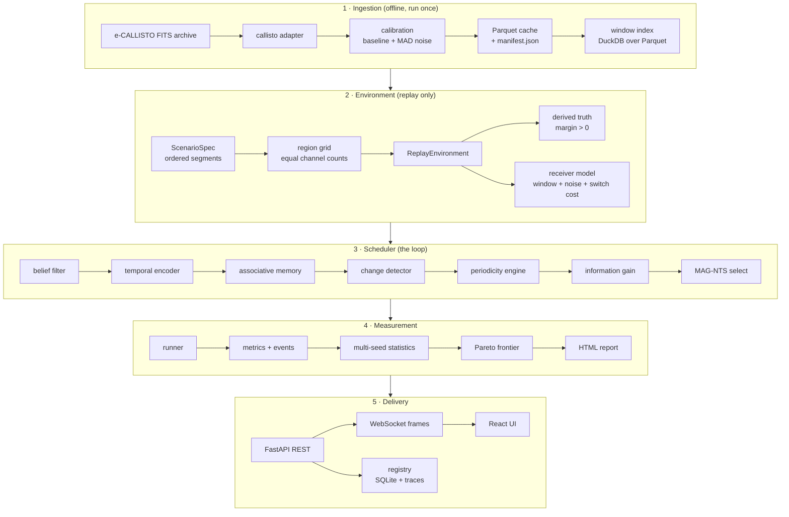
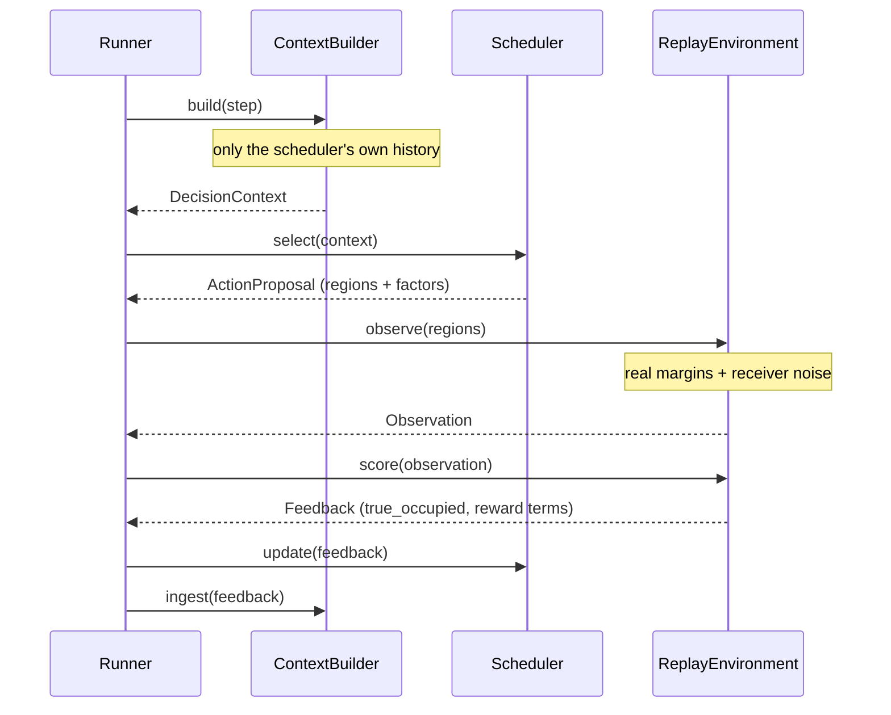
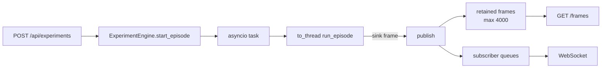
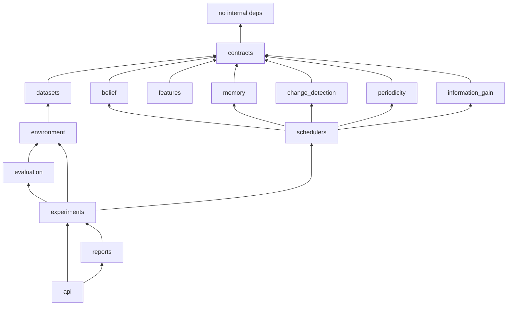

# Architecture

AAMS-X is a closed sensing loop wrapped in a measurement harness. The loop is the
research contribution; the harness exists so that every claim about the loop can be
re-executed from a stored configuration.

## The layers

Layer 1 runs once and never again during an experiment. Layers 2–4 are pure functions
of `(ScenarioSpec, scheduler, seed, AblationFlags)` — which is exactly what the
registry stores, and exactly why **Replay Experiment** re-executes rather than
re-renders.

## The step

One environment step, end to end:

The scheduler receives a `DecisionContext` and answers with an `ActionProposal`. It
never holds a handle to the environment, so hidden state cannot reach it by
construction.

## Leakage prevention

Three independent mechanisms, because one is a promise and three are a design:

1. **No handle.** `select()` takes `DecisionContext` only. Every array in it is
   derived from the scheduler's own observations — `belief`, `staleness`,
   `observation_counts`, `hit_rate`, `information_gain`, `periodicity_score`. There is
   no field carrying unobserved state.
2. **Sealing.** `ReplayEnvironment.sealed()` raises `LeakageError` if truth is touched
   outside the scoring path. `tests/test_no_leakage.py` seals the environment and runs
   full episodes of every scheduler.
3. **Freezing.** `DecisionContext.freeze()` returns a deep copy with every array
   marked read-only. A scheduler that mutates its input fails loudly rather than
   silently corrupting the next step.

Ground truth appears in exactly one place: `Feedback.true_occupied`, for the
**already-chosen** window. That is the standard bandit contract — you learn what you
observed, never what you did not.

## Split discipline

Stations carry a role, and the roles are enforced by test:

| Role | Stations | Used by |
|---|---|---|
| `train` | INDIA-GAURI/02, SWISS-Landschlacht/63 | tuning, six of seven presets |
| `validation` | EGYPT-Alexandria/01 | preset construction, sanity checks |
| `unseen` | MRO/60, AUSTRIA-OE3FLB/55, SSRT/59, SWISS-MUHEN/62 | the `unseen-generalization` preset only |

`tests/test_scenarios.py::test_only_the_held_out_preset_touches_the_held_out_receivers`
asserts that no other preset touches a held-out receiver, and that the held-out preset
touches nothing else. MAG-NTS's factor weights were tuned on `train` roles only
(`data/index/mag_nts_tuning.json` records the protocol).

## Persistence

| Store | Technology | Holds |
|---|---|---|
| Recording cache | Parquet `FixedSizeList<uint8>` + `manifest.json` | quantised spectrograms, provenance, gaps |
| Window index | DuckDB view over Parquet | one row per candidate window, with 18 measured statistics |
| Experiment registry | SQLite | id, kind, scheduler, seed, ablation, `config_hash`, status, metrics |
| Traces | JSON under `data/traces/` | full `EpisodeResult` for replay and reporting |
| Reports | HTML under `reports/out/` | rendered from traces, never from placeholders |

`config_hash` is the first 16 hex characters of the SHA-256 of the canonical, sorted
JSON of the run configuration. Two runs share a hash exactly when they will produce
the same numbers — which is what makes the replay button checkable rather than
decorative.

## Async engine

The scheduler loop is CPU-bound and synchronous, so it runs in a worker thread and
publishes frames back into the event loop:

Two details that matter:

- **Pacing changes only when frames are emitted, never what is computed.** A 1200-step
  episode finishes in about a second, too fast to watch, so the sink throttles to a
  target frame rate. A paced run and an unpaced run of the same seed produce
  byte-identical results.
- **The launch endpoints are deliberately `def`, not `async def`**, because resolving a
  scenario reads Parquet from disk and must not block the event loop. FastAPI runs them
  in a worker thread, which has no running loop, so `ExperimentEngine.bind_loop()`
  captures the serving loop at startup and `_spawn()` hands the driver coroutine back
  to it. Getting this wrong makes every launch endpoint raise
  `RuntimeError: no running event loop`, which is what `tests/test_api.py` caught.

## Module dependency direction

Nothing points downward into `api` or `experiments`, so the whole loop is importable
and testable without FastAPI.
