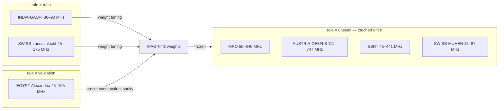
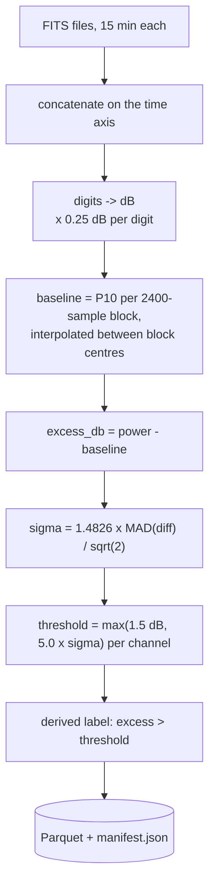

# Data

AAMS-X runs on **real, public spectrum recordings**. There is no parametric simulator
anywhere in the pipeline: every episode replays a block of measurements that a physical
receiver actually published. This document covers where the data comes from, what is
done to it, what is *derived* rather than measured, and how the offline cache and window
index are laid out.

## 1 · Source

| | |
|---|---|
| Network | **e-CALLISTO** — International Network of Solar Radio Spectrometers |
| Archive | `http://soleil.i4ds.ch/solarradio/data/2002-20yy_Callisto` |
| Format | FITS, one file per 15 min per station sweep |
| Credentials | **None.** The archive is open; no key, no account, no rate-limit token |
| Licence | Public scientific data — free use with attribution (e-callisto.org) |
| Reference | Benz, Monstein & Meyer (2005), *CALLISTO — A New Concept for Solar Radio Spectrometers*, Solar Physics **226**, 143 |

Two other adapters exist. `datasets/sigmf.py` imports a user's own
`.sigmf-meta`/`.sigmf-data` pair (import-only, treated as untrusted input — see §7).
`datasets/electrosense.py` is implemented and offline-aware. Measured 2026-08-27:
`api.electrosense.org` has no DNS record, and `electrosense.org` resolves
(213.133.104.36) but serves a TLS certificate issued for a different hostname, so the
handshake fails with `CERTIFICATE_VERIFY_FAILED`. The adapter therefore reports
`unavailable` rather than pretending, and distinguishes *DNS-only* from *probed*: it
answers from DNS by default (so listing datasets never waits on a dead host) and sets
`verified: true` only after one real request. `GET /api/datasets` lists all three
adapters with that status.

**The system never silently substitutes synthetic data.** A missing recording raises
`CacheMiss` naming what *is* cached; an unavailable adapter raises `AdapterUnavailable`.
Both surface as errors in the API and in the UI.

## 2 · The seven curated recordings

Station selection was not guessed. `scripts/survey_stations.py` downloads real
observations from every station in the network and measures, per *(station, focus-code)*
pair, the achieved frequency span, the occupied-cell fraction under the AAMS-X labelling
policy, and the count of **live channels** — channels that are neither permanently silent
nor permanently saturated. Live-channel count is the property that decides whether a
recording poses a scheduling problem at all: if regions do not genuinely differ from one
another, every policy scores the same.

The focus code matters more than it looks. One physical station publishes several
interleaved sweeps (`MRO` publishes four), each covering a different sub-band. Mixing
them would silently corrupt the frequency axis, so **every catalogue entry pins exactly
one focus code**, and the pinning is recorded in provenance.

| Station | Focus | Band (MHz) | Live ch. | Occupancy | Archetype | Role | On disk |
|---|---|---|---|---|---|---|---|
| INDIA-GAURI (Gauribidanur) | 02 | 30.0 – 89.9 | 134 | 0.0619 | dense-intermittent | `train` | 20 MB / 12.00 h |
| SWISS-Landschlacht | 63 | 45.0 – 174.6 | 82 | 0.0989 | mixed-persistent | `train` | 22 MB / 12.00 h |
| EGYPT-Alexandria | 01 | 45.0 – 164.9 | 160 | 0.1215 | intermittent | `validation` | 26 MB / 11.99 h |
| MRO (Murchison) | 60 | 50.0 – 846.2 | 194 | 0.1116 | wideband-mixed | `unseen` | 23 MB / 12.00 h |
| AUSTRIA-OE3FLB (Litschau) | 55 | 112.0 – 747.2 | 57 | 0.0419 | sparse-bursty | `unseen` | 24 MB / 11.75 h |
| SSRT (Badary) | 59 | 45.1 – 441.2 | 85 | 0.0369 | broad-lowcontrast | `unseen` | 6 MB / 3.99 h |
| SWISS-MUHEN (Muhen) | 62 | 15.0 – 86.9 | 167 | 0.0947 | hf-diurnal | `unseen` | 23 MB / 12.00 h |

**139 MB total, 200 channels each, 0.25 s cadence, archive day 2026-08-25 06:00 UTC.**
SSRT is short because the archive published only 4 h for that sweep on that day; the
cache records what exists rather than padding it.

Each recording earns its place:

- **INDIA-GAURI** is the only station publishing a full 24 h, so it is the source for
  long-horizon and diurnal experiments. Persistent carriers, intermittent utility
  traffic and quiet guard bands coexist in one recording.
- **SWISS-Landschlacht** is the clearest "some regions are always worth watching, most
  are not" example: strong persistent FM broadcast carriers with intermittent activity
  between them.
- **EGYPT-Alexandria** shares the nominal band of the training stations but has a
  different receiver, sky and interference population — a fair validation split for
  tuning without touching the test set.
- **MRO** spans 796 MHz inside a legally protected radio-quiet reserve and still has the
  densest live-channel count in the cache.
- **AUSTRIA-OE3FLB** is the sparsest: 4% occupancy over 635 MHz with 57 live channels.
  Uninformed scanning finds very little here, which is exactly the point.
- **SSRT** is low-contrast — many weakly active channels near the decision boundary,
  stressing uncertainty estimation rather than raw detection strength.
- **SWISS-MUHEN** reaches into HF, where ionospheric propagation adds slow diurnal
  structure on top of fast local activity: the cache's best source of genuine
  multi-scale periodicity.

## 3 · The generalisation split



`role` defines a leakage-free split. A scheduler tuned on `train` recordings is finally
tested on `unseen` recordings that differ in **band, receiver hardware, continent and
occupancy density** — not merely in time offset. The four unseen stations are used by
exactly one preset (`unseen-generalization`) and one family (`unseen-combination`), and
`tests/test_scenarios.py::test_only_the_held_out_preset_touches_the_held_out_receivers`
fails the build if any other preset touches them. Tuning ran on `train` roles only; the
protocol is recorded in `data/index/mag_nts_tuning.json`.

## 4 · Ingestion and calibration



Constants, all recorded in every manifest so a reader never has to trust the code:

| Setting | Value | Env override |
|---|---|---|
| dB per digit | 0.25 (e-CALLISTO nominal scale) | `AAMSX_DB_PER_DIGIT` |
| Baseline block | 2400 samples (10 min at 0.25 s) | — |
| Baseline percentile | 10 | `AAMSX_BASELINE_PERCENTILE` |
| Minimum excess | 1.5 dB | `AAMSX_OCCUPANCY_THRESHOLD_DB` |
| MAD multiplier | 5.0 | `AAMSX_OCCUPANCY_K_MAD` |

Why each choice:

- **Drift-tracking baseline.** A single global reference would drift with receiver gain
  and sky temperature over 12 h. P10 inside a 10-minute block estimates the quiet floor
  even when most of the block is busy, and interpolating between block centres avoids a
  step discontinuity every 2400 samples.
- **First-difference MAD.** `diff` removes the slow drift, MAD removes the outliers that
  are the signal, and `/√2` corrects for differencing two independent samples. The
  measured result is credible: median per-channel noise 0.26 dB at MRO.
- **The floor.** `max(1.5 dB, 5σ)` means a very quiet channel cannot produce detections
  from a 5σ excursion of 0.1 dB. Every real threshold in the cache sits at the 1.5 dB
  floor for the median channel, and above it where the channel is genuinely noisy.

### Derived labels, not ground truth

Absolute calibrated power is not available from the archive, and no per-emitter
annotation exists. The occupancy matrix is therefore a **reference label derived from
measurement under a stated policy** — a thresholded excess — not absolute truth.
Consequences, stated wherever the numbers appear:

- Detection metrics are measured against this label, so a systematic labelling bias
  would bias every policy equally but would not cancel out of absolute values.
- Every API response computed from it carries `"label_kind": "derived-label"`, and
  `"kind"` distinguishes `measured` / `derived-label` / `model-inferred` so the UI can
  label each panel rather than letting the reader assume.
- The HTML report prints the disclaimer in the body, not a footnote.

## 5 · Cache layout

```
data/cached/<STATION>/<YYYYMMDD>/
├── manifest.json      schema_version, geometry, calibration summary, provenance
├── power.parquet      int16 digit matrix, zstd, row-chunked for sliced reads
└── channels.parquet   per-channel freq_mhz, baseline, noise_db, threshold_db
```

`load_raw(recording_id, start_step=…, n_steps=…)` reads only the row groups it needs, so
a 60-step episode does not deserialise 172 799 samples. Requests past the end fail with
arithmetic in the message (`… needs N samples … only M available`), which is what makes
an out-of-range scenario a 422 instead of a truncated episode.

`region_margin_series` — used when the whole recording is needed — works in
`CHUNK_SAMPLES` blocks and deletes each cube as it goes, so indexing a 12 h recording at
200 channels does not need the whole thing resident.

### Provenance record

Every recording carries, and every response echoes: `adapter`, `source_id`,
`source_url`, `retrieved_at`, `observed_from` / `observed_to`, `n_source_files`,
`n_samples`, `freq_resolution_khz`, `time_resolution_sec`, an ordered
**`preprocessing`** list naming each transformation applied, `license`, `reference`, and
`is_synthetic: false`. The Real Spectrum Replay screen renders it verbatim.
`tests/test_api.py` asserts `is_synthetic is False` on every cached recording — the
guard behind "real data only".

## 6 · The window index

`scripts/build_index.py` turns the cache into a **searchable scenario library**. It
characterises every window in every recording and writes one Parquet table, so a
scenario can be defined by a *query* — "the most periodic real window available" —
instead of a hand-written constant that nobody can check.

```
python scripts/build_index.py
python scripts/build_index.py --regions 48 --window-steps 1200
```

Geometry of the sweep: `n_regions = 48`, window lengths `(400, 600, 1200)` steps, time
bins `(4, 20, 60)` native samples per step, stride `span // 2` (50% overlap so a feature
cannot fall between two windows). The three lengths are the three scenario shapes —
1200 for a single phase, 600 for a two-way splice, 400 for an A→B→A′ recurrence — and
`tests/test_scenarios.py` asserts the index contains nothing else.

Each row carries `recording_id`, `station`, `start_step`, `time_bin`, `n_steps`,
`n_regions`, `duration_sec`, the 48-element `profile`, and the measured statistics:
`occupancy`, `persistence`, `onset_rate`, `burstiness`, `intermittent_regions`,
`persistent_regions`, `quiet_regions`, `period_steps`, `period_strength`,
`concentration` (Gini over the per-region profile), `profile_drift` (first half vs
second half), `mean_margin_db`, `p95_margin_db`, and an `archetype`.

**Current index: 3350 windows across 7 recordings.** Archetypes discovered, entirely by
measurement:

| Archetype | Windows | Rule that assigned it |
|---|---|---|
| `bursting` | 2339 | `burstiness > 1.6` |
| `rapidly-changing` | 506 | `persistence < 0.55` |
| `persistent` | 160 | `≥ R/8` regions above 0.5 occupancy **and** `persistence > 0.9` |
| `intermittent` | 139 | `≥ R/3` regions in `[0.02, 0.5]` |
| `periodic` | 116 | `period_strength > 0.55` with a non-zero lag |
| `quiet` | 89 | `occupancy < 0.02` |
| `mixed` | 1 | fell through every rule |

That distribution is itself a finding: **real spectrum is overwhelmingly bursty**, and
only 3.5% of windows carry periodicity strong enough to schedule against. A simulator
tuned to look interesting would not have produced this shape.

The index is queryable over HTTP at `GET /api/datasets/index/windows?where=…&order_by=…`
— the same table the scenario builder reads. `profile` is excluded from the API response
because a 48-vector is not a summary field.

## 7 · Untrusted input

Imported datasets are treated as untrusted:

- **File type and size** are validated before parse; oversized or wrong-magic files are
  rejected with a 422.
- **Uploaded content is never executed.** SigMF metadata is parsed as JSON into a
  Pydantic model; no `eval`, no pickle, no dynamic import.
- **Path traversal is blocked** on every filename-shaped parameter. Report ids are
  validated against a strict pattern; `tests/test_api.py` parametrises four traversal
  attempts and asserts each is refused.
- **SQL on the window index** is restricted to simple predicates: the tokens `;`, `--`,
  `/*`, `attach`, `copy`, `install`, `pragma`, `create`, `drop` are refused with 422
  `only simple SQL predicates are accepted`, and the query runs read-only against a
  single Parquet file. Five injection attempts are parametrised in the tests.
- **No credentials are logged** and no secret reaches the browser. The archive needs
  none; any optional credential is read from the environment via `.env` (see
  `.env.example`) and never echoed in a response, a log line or a provenance record.

## 8 · Reproducing the cache

```bash
python scripts/fetch_real_data.py                     # whole catalogue, 12 h each, ~139 MB
python scripts/fetch_real_data.py --hours 4           # quicker
python scripts/fetch_real_data.py --station MRO/60    # one recording
python scripts/fetch_real_data.py --date 2026-08-25   # pin the archive day
python scripts/build_index.py                         # rebuild the window index
```

Recordings already present are skipped unless `--force` is passed, so the script is safe
to re-run after a dropped connection. The default day is `2026-08-25` starting 06:00
UTC, which is the day the shipped index was built from — pin it to reproduce the exact
numbers in [EXPERIMENTS.md](EXPERIMENTS.md). Any other day gives a valid cache and
different windows; the scenario builder queries the index rather than hard-coding
offsets precisely so that still works.
