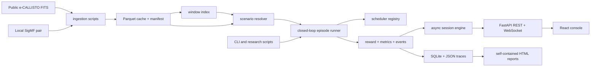

# Developer guide

This is the maintainer map for AAMS-X. It explains what owns each behavior, where a
change belongs, and which nearby layers must move with it. For the mathematical details,
follow the links to [Algorithms](ALGORITHMS.md); for exact runtime sequencing, use
[Runtime and data](RUNTIME_AND_DATA.md).

## System at a glance



The Python scientific core does not depend on FastAPI or React. The API and CLI call the
same runner, which is why a browser run and a terminal run use the same scheduling and
metric code.

## Technology and runtime requirements

| Layer | Technology | Declared requirement |
|---|---|---|
| Backend | Python, NumPy, SciPy, FastAPI, Pydantic | Python 3.12 or newer |
| Data | PyArrow Parquet, DuckDB, SQLite, JSON | local filesystem |
| Frontend | React 19, TypeScript, Vite, TanStack Query, Zustand | Node 20.19 or newer |
| Visuals | ECharts, Three.js, Canvas | modern browser/WebGL for 3-D views |
| Optional | PyTorch | `pip install -e ".[neural]"` |
| Deployment | Docker, nginx, single EC2 host | public HTTP in the current AWS shape |

Python dependencies and the `aamsx` console entry are declared in `pyproject.toml`.
Frontend dependencies and scripts are in `web/package.json`.

## Repository map

```text
.
├── aamsx/                 Python package
│   ├── api/               FastAPI factory, wire schemas, route handlers
│   ├── belief/            online two-state belief filter
│   ├── change_detection/  Page-Hinkley + EWMA composite detector
│   ├── contracts/         internal dataclass boundaries
│   ├── datasets/          adapters, FITS/SigMF, calibration, cache and index
│   ├── environment/       scenario selection, truth assembly, replay wall
│   ├── evaluation/        rewards, event metrics, statistics and Pareto
│   ├── experiments/       context builder, runner, batches, engine, registry
│   ├── features/          rolling observation buffer and encoders
│   ├── information_gain/  expected entropy reduction
│   ├── memory/            bounded associative context memory
│   ├── periodicity/       online recurrence estimates
│   ├── receiver/          window geometry, noise and sensing cost
│   ├── reports/           Jinja2 HTML report generator and template
│   ├── schedulers/        policy interface, registry, baselines and MAG-NTS
│   ├── cli.py             `aamsx` command implementation
│   ├── config.py          environment-backed settings
│   ├── logging.py         human/JSON logging setup
│   └── version.py         code, scheduler and contract versions
├── web/                   React single-page console and nginx image
├── tests/                 backend unit, property, API and integration tests
├── scripts/               ingestion, indexing, benchmark, tuning and audits
├── data/                  recordings, index, registry and result traces
├── reports/out/           benchmark JSON and generated HTML reports
├── deploy/                AWS instance bootstrap script
├── docs/                  documentation system
├── Dockerfile             backend image
├── docker-compose.yml     local two-service stack plus tool profiles
├── docker-compose.aws.yml single-host AWS stack
├── Makefile               common developer commands
└── pyproject.toml         Python package and tool configuration
```

Generated directories such as `__pycache__`, `web/dist`, `.pytest_cache`, and
`web/node_modules` are not architecture. The `data/` and `reports/out/` contents are
runtime/research artefacts and can be large; do not bake them into the backend image.

## Entry points and startup order

### Backend service

`aamsx.api.app:create_app` is the FastAPI factory. Importing `aamsx.api.app` also creates
a module-level `app`, but the documented server commands use factory mode.

Startup does the following:

1. `create_app()` loads settings and creates required directories.
2. It installs CORS, routers, an unhandled-exception response, OpenAPI, and `/api/health`.
3. The lifespan hook configures logging.
4. It binds the singleton `ExperimentEngine` to the running asyncio loop.
5. It lists cached recordings and logs a warning if none exist.

There is no shutdown hook for active tasks. The cache is allowed to be empty at startup;
data-dependent calls then return warnings, 404, 422, or 503 as appropriate.

### Command line

`pyproject.toml` installs `aamsx = aamsx.cli:main`. The subcommands are:

| Command | Purpose |
|---|---|
| `run SCENARIO` | execute and record one episode |
| `arena SCENARIO` | compare selected schedulers over identical seed numbers |
| `ablation SCENARIO` | run the seven-rung MAG-NTS ablation ladder |
| `replay ID` | re-execute one stored episode and compare metrics |
| `report` | render stored results into one HTML report |
| `history` | list registry rows |
| `presets` | list currently buildable scenario presets |
| `schedulers` | list registered policies |
| `info` | show cache, index and adapter state; optionally probe ElectroSense |
| `serve` | start Uvicorn, defaulting to localhost |

`run`, `arena`, and `ablation` write a registry row before executing and finish it on
success or failure. The research scripts call the same episode and batch functions.

### Browser application

`web/src/main.tsx` mounts the providers in this order: TanStack Query, browser router,
shared live-stream provider, error boundary, then the application shell. `App.tsx`
lazy-loads each screen. In development Vite proxies `/api` to the backend; in production
nginx serves the SPA and proxies the same path to the `api` container.

### Data preparation

The application can boot without data, but useful scenarios require this order:

1. `scripts/fetch_real_data.py` downloads and caches public recordings.
2. `scripts/build_index.py` profiles overlapping windows and writes
   `data/index/windows.parquet`.
3. scenario builders query that index and load the referenced cache slices.

Changing calibration settings requires rebuilding cached calibration and the index before
old metrics can be meaningfully compared.

## Ownership by module

| Behavior | Primary owner | Important collaborators |
|---|---|---|
| Configuration and paths | `aamsx/config.py` | `.env.example`, Compose files |
| Public measurement ingestion | `datasets/callisto.py`, `datasets/fits.py` | `datasets/calibration.py` |
| Local SigMF import | `datasets/sigmf.py` | `datasets/store.py`; no HTTP upload route exists |
| Cache format | `datasets/store.py` | `contracts/spectrum.py` |
| Scenario search | `datasets/windows.py`, `environment/scenarios.py` | station roles |
| Hidden reference assembly | `environment/truth.py` | grid and cache readers |
| Partial-observation enforcement | `environment/replay.py` | contracts and leakage tests |
| Observation features | `features/`, `belief/`, `periodicity/` | `experiments/context.py` |
| Policy selection/update | `schedulers/` | `contracts/observation.py` |
| Reward and metrics | `evaluation/` | runner and event tracker |
| Canonical episode sequence | `experiments/runner.py` | all scientific components |
| Multi-seed execution | `experiments/batch.py` | process pool, statistics, Pareto |
| Browser background runs | `experiments/engine.py` | registry and WebSocket route |
| Reproducibility records | `experiments/registry.py` | `data/registry.sqlite`, traces |
| HTTP contract | `api/schemas.py`, `api/routes/` | `web/src/api/types.ts` |
| Browser server state | TanStack Query | `web/src/api/queries.ts` |
| Browser live state | `api/stream.ts`, `LiveProvider.tsx` | WebSocket endpoint |
| Browser user choices | `state/session.ts` | localStorage key `aamsx.session` |
| Reports | `reports/html.py` and template | stored result JSON only |

## Internal contracts

The `contracts` package is the core boundary:

- `RawRecording` is native quantised time × channel data with axes and provenance.
- `MeasurementCube` is calibrated excess dB with a per-channel threshold.
- `ScenarioSpec` describes ordered real-data segments, receiver, reward, budget and split.
- `Observation` contains only the chosen receiver window.
- `DecisionContext` contains only quantities derived from earlier observations.
- `ActionProposal` contains the scheduler's contiguous window and its explanation.
- `Feedback` contains the chosen window's scored outcome after the action was made.

Wire models in `api/schemas.py` are intentionally separate. Frontend types are manually
maintained, not generated from OpenAPI, so an API change must update all three layers.

## Extension points

### Add a scheduler

1. Subclass `BaseScheduler` and implement `reset`, `select`, `update`, and `snapshot`.
2. Give it a unique `name` and decorate it with `@register`.
3. Import its module from `schedulers/__init__.py`; registration is import-driven.
4. Add it to `ARENA_ORDER` only if it belongs in the default scientific comparison.
5. Update the frontend `SchedulerName` union and any factor display assumptions.
6. Add deterministic/seed, no-leakage, unavailable-observation, and API-catalogue tests.
7. Re-run benchmarks before making any performance claim.

### Add a data adapter

Normalize the source into `RawRecording` with a complete `Provenance`. Validate size,
geometry and declared types before allocating large arrays. Reuse `write_recording`; do
not create an adapter-specific downstream path. Add the adapter's honest status to the
dataset route only when it has a usable integration path.

### Add a scenario family or preset

Define behavior as a query over measured window statistics in
`environment/scenarios.py`. Respect station roles. A preset must fail as unavailable when
the cache cannot satisfy it; it must never substitute generated data. Test the role split,
deterministic seed selection, segment arithmetic, and an empty or incomplete cache.

### Add an endpoint

Create or reuse a Pydantic edge model, put the handler in the appropriate route module,
map domain failures to a deliberate status code, update `API.md`, `web/src/api/client.ts`,
`web/src/api/queries.ts`, and `web/src/api/types.ts`, then add OpenAPI and behavior tests.
Do not use CORS as authentication.

### Add a screen

Add the lazy import and route in `App.tsx`, navigation metadata in `lib/nav.ts`, then use
TanStack Query for server state, `LiveProvider` for high-rate session data, and Zustand
only for cross-screen user choices. Provide loading, empty and failure states. Check the
route string anywhere code navigates programmatically.

## Change playbooks

### Change a reward term

Touch `contracts/scenario.py`, `evaluation/reward.py`, metric/report presentation,
Pydantic request validation, frontend request types and controls, algorithm docs, and
sensitivity scripts. Stored results remain historical; do not silently reinterpret them.
Bump the scheduler or contract version when old and new results are no longer directly
comparable.

### Change calibration or occupancy labels

Touch calibration/store code, `.env.example`, data docs and provenance. Re-ingest or
recompute calibration, rebuild the index, rebuild presets, rerun all experiments, and
regenerate published tables. This changes the evaluation reference and therefore every
detection metric.

### Change a streamed frame

Touch `runner.py::_frame`, `web/src/api/types.ts`, WebSocket ingestion, and every screen
reading the field. Keep frames JSON-safe and consider the cost multiplied by 4,000 retained
frames and every subscriber.

### Change persistence

There is no migration framework. A SQLite column or cache manifest change needs an
explicit backward/forward strategy, migration tooling, fixture tests, and a schema-version
check. Write files atomically before relying on them after a process crash.

### Change deployment exposure

The API currently assumes a trusted research environment. Before exposing a new port or
hostname, address TLS, authentication, authorization, rate limits, request limits, SQL
query exposure, secrets, backups, and observability. See the deployment gate in
[Operations](OPERATIONS.md#production-readiness-gate).

## New-feature checklist

- [ ] Define the user-visible behavior and non-goals.
- [ ] Identify the owning module from the table above.
- [ ] State whether the change affects scientific results or only presentation.
- [ ] Add or change an internal contract before coupling modules directly.
- [ ] Validate all untrusted values at the edge and again before expensive allocation.
- [ ] Preserve the hidden-truth boundary.
- [ ] Keep unavailable data explicit; do not fabricate a fallback.
- [ ] Decide what is persisted, replayed, hashed, logged and deleted.
- [ ] Handle startup, active, complete, empty, cancelled, failed and evicted states.
- [ ] Update Python wire models, frontend types, client and UI together.
- [ ] Add unit, integration, failure-path and reproducibility tests.
- [ ] Test with the minimum supported Python and Node versions.
- [ ] Run lint, type checks, frontend build, backend tests and documentation verification.
- [ ] Update the source-of-truth document and remove resolved risk-register entries.
- [ ] Rerun experiments instead of editing measured numbers by hand.

## Rules for AI coding agents

1. Read `docs/README.md`, this guide, and the document for the layer being changed.
2. Trust executable code over prose; search every reference to a setting before claiming
   it is enforced.
3. Do not read or print `.env` values unless the user explicitly needs secret handling.
4. Preserve `data/`, `reports/out/`, existing user edits, and unrelated files.
5. Do not change a scientific constant only to make a benchmark or test pass.
6. Do not give a scheduler full-band truth or future samples.
7. Do not describe derived occupancy as physical ground truth.
8. Do not claim DQN, neural encoding, concurrency, upload, TLS, or auth behavior from a
   setting name; confirm the actual call path.
9. Prefer a focused patch with explicit tests over broad cleanup.
10. If the code and docs disagree, record the discrepancy and update the authoritative
    document in the same change.

## Glossary

| Term | Meaning in this repository |
|---|---|
| anchor | first region of a contiguous receiver window |
| belief | estimated probability that a region is occupied now |
| cache | local Parquet representation of a real recording |
| derived label | occupancy produced by the configured threshold policy |
| environment step | one time-binned decision/observation cycle |
| frame | JSON snapshot emitted for a sampled episode step |
| hidden truth | complete derived occupancy reference held by the environment/evaluator |
| margin | dB above a channel or region's decision threshold; zero is the boundary |
| native step | source recording cadence, normally 0.25 seconds for shipped data |
| pace | delay between emitted frames; it does not change episode calculations |
| preset | scenario assembled by querying the measured window index |
| recording id | `STATION/YYYYMMDD` cache identifier |
| region | contiguous group of source channels and unit of scheduling |
| replay environment | partial-observation wrapper over cached measurements |
| replay experiment | re-execution of a registry configuration and seed |
| scenario segment | real cache slice, with native start and environment-step length |
| scheduler | policy that selects the next receiver window |
| split | station role: train, validation, or unseen |
| trace | persisted final episode or batch result JSON; it does not contain all frames |
| window index | Parquet table of measured statistics for candidate cache slices |

## Critical files

If context is limited, inspect these first:

1. `aamsx/experiments/runner.py` — canonical scientific loop.
2. `aamsx/experiments/context.py` — what the scheduler is allowed to know.
3. `aamsx/environment/replay.py` — the partial-observation wall.
4. `aamsx/schedulers/base.py` and `mag_nts.py` — policy contract and primary policy.
5. `aamsx/datasets/store.py` — persisted measurement representation.
6. `aamsx/experiments/engine.py` — browser concurrency and streaming behavior.
7. `aamsx/api/routes/` and `api/schemas.py` — external contract.
8. `web/src/api/client.ts`, `stream.ts`, `state/session.ts`, and `App.tsx` — frontend
   boundaries and routes.
9. `docs/QUALITY_AND_RISKS.md` — known places where names or comments overstate behavior.
