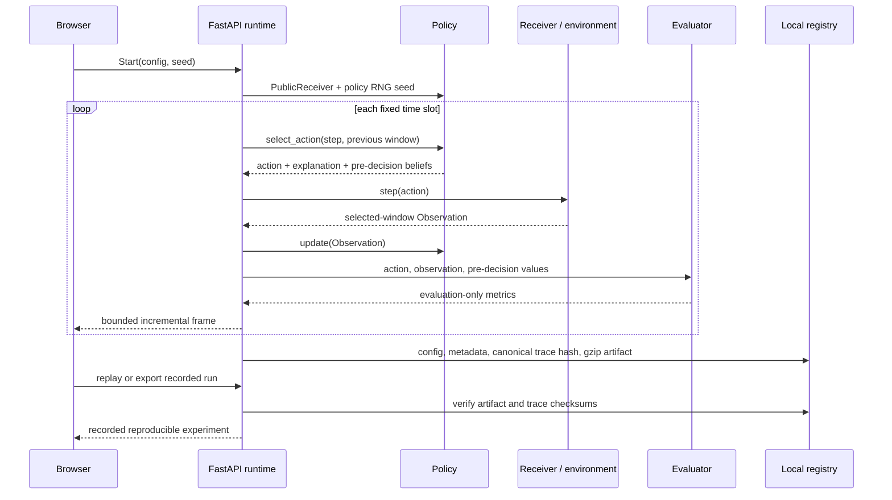

# Engineering and evaluation notes

## Time and cost model

All policies share a fixed wall-clock slot duration. Retuning consumes time *inside* that slot; it is not free extra time and it does not give one policy a longer horizon. Usable dwell must satisfy the validated minimum.

Let `d` be usable dwell/slot, `E` the observed energy, `F` the reference floor, `θ` the threshold and `m` the additional miss probability:

```text
p_energy = sigmoid((E − F − θ) / 1.25)
p_detection_component = p_energy × d × (1 − m)
p_spurious_component = configured_spurious_probability × d
HIT = shared_uniform_1 < p_detection_component
   OR shared_uniform_2 < p_spurious_component
```

The detector does not receive truth. Conditional Pd/Pfa are measured after sampling by the evaluator. The two random fields are indexed by `(time, band)` and shared between receivers, so decisions do not alter the noise draws available to another policy.

## Learning assumptions

Beta evidence models observed activity; confidence-weighted detector observations and discounting are approximate Bayesian updates. Model uncertainty is normalized relative to the initial Beta(1,1) variance. Information gain is exact for the *assumed* Beta-Bernoulli model, not a claim that every underlying RF process is Bernoulli.

Episodic memory predicts a subsequent **observed visit's** outcome from a prior four-observation context. Irregular sampling means it is not a fixed-rate transmitter state model. Retrieval support, similarity, previous outcome and contribution are stored for inspection.

CUSUM uses observation-time residuals against the current belief. It is not updated by out-of-window simulator events. Supported changes shrink accumulated evidence to 20% above the prior and add a decaying priority term.

Recurrence fitting uses separated high-confidence HIT episodes, candidate integer multiples of observed intervals and circular phase agreement. Observed misses near expected phase reduce evidence; unobserved times do not count as misses. It requires at least four episodes and a three-cycle span. The fitted confidence is a heuristic evidence score, not calibrated probability. False candidates and aliases remain visible.

The current candidate search is bounded to 6–100 time slots. It estimates coarse band-activity recurrence, not microsecond pulse repetition interval (PRI). Time/frequency aggregation can conceal short pulse structures, so results must be interpreted at the experiment's stored resolution.

## Metric denominators

For observed valid cells, the evaluator records TP, FP, TN and FN. For global recall it additionally counts **all** active cells, including those never observed. Consequently detector Pd can be high while global interception share is low.

A band episode starts at a `False → True` transition in the occupancy matrix. Its first true detection determines delay. Multiple contiguous bands from one source create multiple band episodes. Simultaneous sources occupying the same cell are not resolved into identified emitters.

Average intercept delay is conditional on intercepted episodes. Undetected episodes are censored and reported in the episode censoring fraction; they are not silently assigned zero delay. Source-first-detection is an evaluation-only overlap measure when source tracks exist and also reports undetected sources.

Prospective recurrence forecasts are stored before the following actual onset. A confidence of at least 0.6 is required. Only the first forecast for each `(band, next actual onset)` is scored; the error enters cumulative metrics when that onset occurs. The score is `abs(predicted_slot − actual_slot) × slot_ms`. Unresolved cases remain pending, and zero resolved forecasts means N/A.

Classification accuracy uses the **pre-observation** band probability thresholded at 0.5. It is computed on valid observed cells; class imbalance and policy selection affect its interpretation. It is not a full-spectrum forecast-accuracy claim.

Evaluation reward is `TP − FP − 0.1 × retune_cost`. The policy receives neither this reward nor the evaluator's confusion matrix. One sensing-cost unit is charged per slot plus normalized retune cost. These are accounting units, not watts.

## Statistical comparison

Every benchmark world is paired by scenario, seed, receiver, time horizon and detector realization. The policy state and RNG are initialized independently. Ablations share the same policy RNG seed so their trajectories can diverge only through policy choices and their resulting observations.

The lab reports the mean, median, sample variance and a two-sided **Student-t 95% mean interval** across seeds. With one seed, variance/interval are N/A. Intervals are descriptive and may extend outside bounded metric ranges; they are not clipped to manufacture precision.

Paired deltas use `metric_MAG − metric_fixed` within each matching world, then summarize those deltas. The UI does not calculate improvement by comparing different seeds or receiver budgets. Lower delay and false-alarm values are preferable; higher recall is preferable. An unconditional “winner” is never hardcoded.

Three seeds are enough for a quick software demonstration, not a strong generalization claim. The UI supports additional runs and alternative configurations. Seed selection and presets are explicit; randomized cases are included even when adaptive gains are small.

## Persistence and replay



UUIDs and ingestion timestamps distinguish experiment records. Scientific determinism is checked on exact frames and world fingerprints, including after serializing and revalidating configuration. Stored traces include pre- and post-update values so replay does not rerun or silently alter the algorithm.

Live controls and WebSocket delivery use the same trace model. Pause waits for any in-flight step to complete before acknowledging. Reset creates a cold-start experiment with a fresh ID and the same scientific configuration. API/CSV/JSON exports contain the recorded configuration and source category.

## Implementation boundaries

This prototype is single-process and localhost-first. Worker threads keep step/benchmark computation off the asyncio delivery loop; they are not a distributed scheduler or a security isolation boundary. The architectural truth test protects regression of policy inputs and common privileged capabilities, not arbitrary hostile Python code.

The software does not implement live RF hardware acquisition, modulation-level waveforms, emitter classification/localization, antenna/propagation physics, or hardware power measurement. Measured intensity is not converted to dBm without calibration. Those assumptions must be addressed before claiming hardware or field validation.
