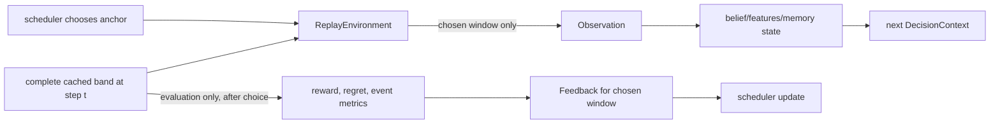
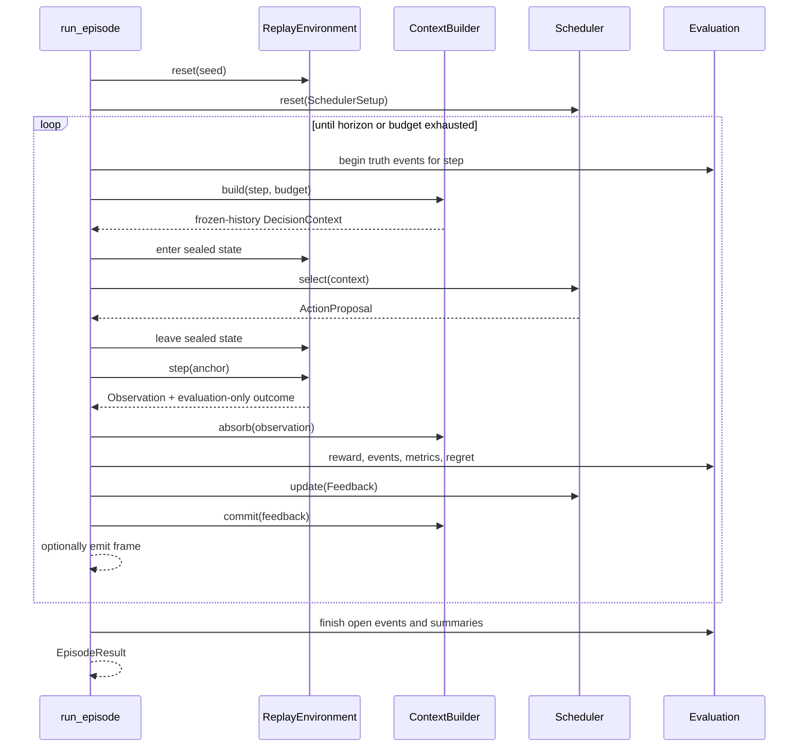

# Runtime and data

This document follows measurements and experiment state through the running system. It
is the source of truth for end-to-end flows, business rules, persistence and background
work. Mathematical derivations live in [Algorithms](ALGORITHMS.md).

## The central boundary

AAMS-X has two different views of the same recorded step:

- The **scheduler view** contains only the window it chose and state derived from its
  earlier chosen windows.
- The **evaluation view** contains the full band's threshold-derived occupancy reference.

The evaluator may score a choice after it is made. It must not influence the choice before
or during `scheduler.select()`.



“Truth” below means `margin_db > 0` under the stored calibration. It is a consistent
reference label, not separately verified emitter truth.

## Data ingestion, end to end

### e-CALLISTO

1. `scripts/fetch_real_data.py` selects the seven catalogue station/focus pairs and a UTC
   interval. Existing manifests are skipped unless `--force` is used.
2. `datasets/callisto.py` lists FITS files in the public archive, downloads them in a
   thread pool, and records gaps instead of fabricating missing files.
3. `datasets/fits.py` parses the required FITS headers and arrays. If a file lacks usable
   axes, it can derive fallback time/frequency axes from header geometry; this synthesizes
   coordinates, not power measurements, and provenance should make the transformation
   visible.
4. Files are combined into `RawRecording`: `uint8` digits, frequency axis, time axis,
   availability mask and provenance.
5. `compute_calibration` estimates a drift-tracking quiet baseline and per-channel noise.
6. `write_recording` writes Parquet and a manifest under the station/day directory.

Network access is used only for ingestion and explicit adapter probes. The deployed API
uses the local cache with network access disabled.

### SigMF

`datasets/sigmf.py` accepts a local `.sigmf-meta`/`.sigmf-data` pair from Python code. It
validates metadata size, data type, sample count, FFT geometry and station slug. Complex
IQ is converted with a Hann-window STFT; real spectral data is reshaped by the supplied
FFT/bin count. Results are quantised onto the common `uint8` digit scale and then use the
normal cache path.

There is currently **no FastAPI upload endpoint or browser upload control**. The installed
`python-multipart` dependency and `AAMSX_MAX_UPLOAD_BYTES` setting do not create one.

### ElectroSense

The adapter and response parsers exist, but the upstream service is currently reported as
unavailable. Dataset listing performs a DNS check unless networking is disabled; an
explicit CLI probe performs one cached HTTP request. Failures never substitute another
source.

## Calibration and cache business rules

The native digits are retained so calibration can be audited. For each channel:

1. a quiet baseline is estimated at the configured percentile (default P10);
2. excess dB is native digit distance multiplied by `db_per_digit` (default 0.25);
3. noise is derived from the channel's measured fluctuation;
4. the threshold is at least 1.5 dB and otherwise `k_mad × noise` (default `k=5`);
5. a channel cell is occupied when excess dB is greater than its threshold.

Regions pool channel **margins**, not raw power. A region's margin is the maximum channel
margin in that region, so the region is occupied when any member channel is above its own
threshold.

`build_grid` sorts frequencies low to high, drops duplicate frequencies by default, and
splits the remaining channels into equal-count groups. Regions have similar channel
counts, not necessarily equal bandwidth.

`bin_time` groups consecutive native samples with a maximum reduction and drops a trailing
remainder that cannot fill a complete bin.

## On-disk data model

```text
data/
├── cached/<STATION>/<YYYYMMDD>/
│   ├── power.parquet
│   ├── channels.parquet
│   ├── baseline.parquet
│   └── manifest.json
├── index/
│   ├── windows.parquet
│   └── mag_nts_tuning.json
├── registry.sqlite
├── traces/<experiment-id>.json
└── sample/

reports/out/
├── aamsx-report-*.html
├── benchmark.json
├── benchmark_thompson.json
├── ablation.json
└── sensitivity_*.json
```

### Recording files

| File | Contents |
|---|---|
| `power.parquet` | `t_sec`, `available`, and fixed-size lists of raw `uint8` digits |
| `channels.parquet` | channel index, MHz, noise, threshold, occupancy summary, dead flag |
| `baseline.parquet` | block index and fixed-size per-channel baseline vectors |
| `manifest.json` | schema version, geometry, calibration parameters, summaries, provenance |

Power row groups are sized to 3,600 rows. `load_raw` calculates row-group offsets and
reads only groups intersecting the requested slice, then loads the complete channel and
baseline metadata.

The current writer records cache schema version 2, but the reader does not reject or
migrate an incompatible version. Cache writes replace files in place rather than using a
temporary directory and atomic rename.

### Window index

`scripts/build_index.py` projects each recording to 48 regions and profiles combinations
of:

- time bins 4, 20 and 60 native samples;
- windows 400, 600 and 1,200 environment steps;
- a stride of half the window length.

Each row includes identity/geometry plus occupancy, persistence, onset rate, burstiness,
region counts, periodicity, concentration, drift, margins, archetype and a 48-value
occupancy profile. The shipped index currently contains 3,350 rows. DuckDB opens an
in-memory connection per query and binds `windows` to the single Parquet file.

### Experiment registry

SQLite has one `experiments` table:

| Column | Meaning |
|---|---|
| `experiment_id` | primary key generated by API or CLI |
| `config_hash` | first 16 hex characters of canonical configuration SHA-256 |
| `kind` | `episode`, `arena`, or `ablation` |
| `scenario_id` | scenario identifier |
| `scheduler` | one name, or comma-separated batch variants |
| `seed` | episode seed; batches store `-1` |
| `ablation` | flag label or `batch` |
| `status` | running/completed/failed/cancelled |
| timestamps | ISO UTC creation and finish strings |
| versions | code and scheduler versions |
| `recordings` | JSON list |
| `config_json` | complete execution configuration |
| `metrics_json` | episode metric summary when supplied |
| `error` | failure text or traceback |

Indices exist on configuration hash and descending creation time. There are no migrations,
foreign keys, ownership fields or retention timestamps. `create` uses `INSERT OR REPLACE`.

Final result JSON is written to `data/traces/<id>.json` before SQLite is updated. These
operations are not one transaction, so a crash can leave a trace without a completed row
or a row without a usable trace. Frames are not stored in the trace; only final curves,
timeline, snapshots and metrics are.

The hash identifies the stored configuration, not the actual bytes of every cache file or
the code version. The row stores versions and recording ids separately. A matching hash is
therefore useful evidence of matching inputs, but not a content-addressed proof that a
changed installation will produce identical numbers.

## Scenario construction

A `ScenarioSpec` is an ordered tuple of segments. Each segment contains:

- `recording_id` in `STATION/YYYYMMDD` form;
- `start_step` in native recording samples;
- `n_steps` in environment steps;
- optional display label and phase.

The required native sample count is `start_step + n_steps × time_bin`. API validation
checks it against each recording before building the internal spec. Horizon is the sum of
environment-step lengths. Change points are the cumulative boundaries between segments.

### Presets

The seven presets are functions over the index, not hard-coded recording offsets:

| Preset | Selection idea |
|---|---|
| `easy-static` | persistent, non-periodic control window |
| `periodic-challenge` | strongest measured significant periodicity |
| `high-noise` | low-contrast data with additional 1.5 dB dwell noise |
| `sudden-shift` | two cross-station profiles chosen for dissimilarity |
| `recurring-environment` | A→B→A′ with separated same-station A windows |
| `extreme-budget` | intermittent window with budget for roughly 35% of steps |
| `unseen-generalization` | two dissimilar held-out receivers only |

Preset results are cached in-process. Rebuilding the index while the API is running does
not invalidate that function cache; restart the API to guarantee rebuilt presets.

Randomized families choose an indexed window by NumPy RNG seed. Multi-segment families
choose a second station; recurring-context attempts to choose a later window from the
first station. `unseen-combination` forces unseen station roles.

### Custom scenarios

The API allows one to eight segments, at most 20,000 total environment steps, 8–256
regions, 1–600 native samples per time bin, and a receiver window no wider than 64 or the
region count. It verifies recording existence, window arithmetic and channel count.

The internal frozen dataclasses do not enforce those ranges when created directly by
Python. Scripts and replayed JSON therefore rely on trusted stored configuration plus
downstream geometry checks.

## One episode, end to end



The precise order matters:

1. The event tracker opens/closes full-band reference events for evaluation.
2. `ContextBuilder.build` predicts belief and creates the only context the scheduler sees.
3. The environment is sealed while `select` runs; truth access raises `LeakageError`.
4. The receiver clamps the proposed anchor to a valid contiguous window.
5. It computes retune distance, cost, effective noise and the chosen measurement.
6. Archive gaps produce zero-valued unavailable observations and zero sensing cost.
7. The belief filter absorbs the measurement before realized information is calculated.
8. The reward model scores hits, information, pending delay, false alarms and switching.
9. The scheduler receives chosen-window feedback only and updates its policy state.
10. The context builder commits rolling buffer, periodicity, change and memory updates.
11. Metrics, timeline and an optional streaming frame are recorded.

The default budget is `horizon × cost_per_observation`. Switch cost is additional, so a
moving policy can exhaust the default before the nominal horizon. The loop checks budget
before an action, not the prospective cost; the final charged action can exceed the budget
before remaining budget is clamped to zero.

## Context state and ablations

One `ContextBuilder` owns a belief filter, temporal buffer, change detector, periodicity
engine, associative memory and encoder.

On `build` it:

- predicts every region's Markov belief forward;
- optionally computes expected information gain;
- reads the current change state and periodicity scores when enabled;
- encodes 18 named global features plus downsampled spatial signatures;
- optionally replaces the context key with a seeded GRU reservoir;
- reads associative memory when enabled;
- freezes/copies arrays into `DecisionContext`.

On `absorb` it updates belief from only the chosen measurement and records realized
entropy change. On `commit` it updates the rolling buffer, periodicity and change detector;
memory writes are conditional.

Important implementation detail: periodicity, buffer and change-detector internals are
still advanced when their contribution flag is off; the flag prevents their output from
reaching the policy. Also, when `temporal_encoder` is off, displayed temporal features are
zeroed only after the context vector was computed, so a memory-enabled ablation may still
key memory using the encoded vector. Treat this as current behavior, not an idealized
definition of the flag.

## Scheduler behavior

All schedulers share the same `SchedulerSetup`, context and feedback contract.

| Policy | State and choice |
|---|---|
| Round Robin | fixed non-overlapping sweep |
| Random | uniform anchor draw from seeded RNG |
| UCB | per-region empirical hits plus confidence bonus, summed over windows |
| Thompson | stationary per-region Beta samples |
| NTS | discounted Beta counts plus change-triggered discount |
| MAG-NTS | NTS sample plus information, memory, periodicity, uncertainty, recency, cost and switching terms |
| DQN, optional | online epsilon-greedy Q network; no pretrained checkpoint or additive explanation |

MAG-NTS chooses the argmax of eight per-anchor contributions. Change detection discounts
its Beta evidence and can increase exploration. Budget pressure attenuates exploration.
Memory is applied when a prior is present and similarity is positive; a similarity above
0.90 is additionally labelled as recognized in notes.

## Reward, events and metrics

Step reward is additive:

```text
detection + information - delay - false_alarm - switching
```

Each component is normalized to approximately the same scale before its scenario weight
is applied. Unavailable archive steps earn no detection/information and no false-alarm or
switching charge, but pending-undetected-event delay still applies.

Cell metrics describe what happened inside observed windows. Event metrics describe
whether the scheduler visited a region during a contiguous reference-occupancy event.
Events of at least three steps are also reported as “sustained.” Missed sustained events
are charged the 64-step delay cap in `time_to_detect_capped`.

Regret is pseudo-regret against a clairvoyant per-step window that contains the most
occupied reference regions. The oracle is evaluation-only.

Across seeds, finite values are summarized with mean, sample standard deviation,
Student-t 95% confidence interval, min, max and median. A comparison is labelled
significant only when Welch's t-test and two-sided Mann-Whitney U are both below 0.05.
Pareto dominance uses sustained detection (maximize), capped time to detect (minimize),
false-alarm rate (minimize), and sensing cost (minimize).

## Batch execution

Arena jobs are the Cartesian product of selected policy names and seeds `0..N-1` on one
scenario. Ablation jobs are seven labelled flag combinations and the same seed range.

`run_batch` runs sequentially when `workers <= 1`; otherwise it uses
`ProcessPoolExecutor`. The default is `max(1, os.cpu_count() - 1)`. API `workers` is
validated at 1–64. The `AAMSX_BATCH_WORKERS` setting is not used by the API/default batch
path; only the tuning script consults it.

Each completed job emits a progress message. Results are grouped by variant, aggregated,
compared with the declared control and given latency/recovery summaries. The browser
engine adds the Pareto description before persistence.

## Async sessions and WebSocket state

The process-wide `ExperimentEngine` stores sessions and asyncio driver tasks in memory.
API launch handlers are synchronous functions executed by FastAPI's worker pool; the
engine schedules their driver coroutine back onto the event loop captured at startup.

Episodes execute `run_episode` in `asyncio.to_thread`. The frame sink sends messages back
to the loop and optionally sleeps to enforce `pace_hz`. Batch drivers also use a worker
thread, which may create a process pool.

Per session:

- at most 4,000 frames are retained;
- timeline events are bounded to 400 in the runner;
- each subscriber queue is hard-coded to 512 messages;
- slow-subscriber messages are dropped rather than stalling the run;
- up to 24 completed/failed sessions are kept, evicted when a new session is created.

The configured `AAMSX_EVENT_QUEUE_SIZE` and `AAMSX_MAX_CONCURRENT_EXPERIMENTS` are not
consulted by this engine. Task entries are not removed from `_tasks` after completion.

Cancellation is best effort. It marks the session, cancels the driver task and relies on a
later frame/progress callback to raise inside background work. A thread or process-pool job
cannot be forcibly stopped by `asyncio.Task.cancel()`.

## Caching and state lifetime

| State | Lifetime |
|---|---|
| Pydantic settings | cached once per Python process |
| scenario presets | cached once per process after first build |
| family pools | LRU cached by family/role/time bin |
| ElectroSense probe | LRU cached per API/timeout pair |
| DuckDB connection | one query only |
| live sessions/frames | process memory, until eviction or restart |
| browser query data | query-specific stale times, not persisted |
| browser launch choices | localStorage, key `aamsx.session` |
| registry/results/reports | filesystem until manually removed |

There is no distributed cache, broker, job queue, event bus or cross-process session
store. Multiple Uvicorn workers would create independent engines; a WebSocket request may
not find a session created in another worker.

## Errors and partial failure

- Pydantic rejects request shape/range errors as 422.
- Route handlers translate missing records, invalid geometry, unavailable data and
  lifecycle conflicts to the statuses documented in [API](API.md).
- Unexpected exceptions are logged and returned as a 500 containing exception class and
  message.
- Episode and batch driver exceptions mark the registry failed and persist a short
  traceback in `error`.
- A missing cache does not stop API startup.
- A corrupt trace is logged and read as no result.
- There is no retry for a failed experiment, cache read, SQLite write or report write.
- Frontend query mutations are never retried. Normal queries retry non-`ApiError` failures
  up to two times; known API errors are shown immediately.

## Reports

The report generator reads only registry rows and stored final result JSON. It formats
missing or non-finite values as “not measured,” draws curves as inline SVG, and uses a
Jinja2 autoescaping environment. Output is a self-contained HTML file named to the
second. It is not a rerun and it does not include retained frames.

The browser previews reports in a sandboxed iframe and links to the API-served file.
Concurrent report requests in the same second can target the same filename.
